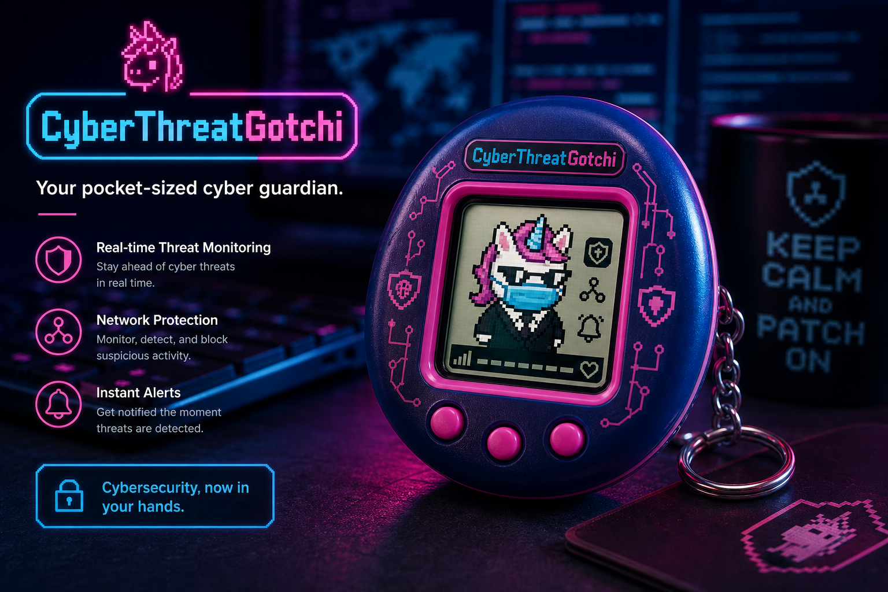

# About CyberThreatGotchi

<p align="center">
  
</p>

<p align="center">
  <em>Your network’s Tamagotchi guardian.</em><br/>
  <strong>Real threats in · mood out · evidence saved.</strong>
</p>

---

## The elevator pitch (12 seconds)

**CyberThreatGotchi** is a defensive edge appliance that **looks like a Tamagotchi and behaves like a SOC sensor**. It sniffs traffic, scores malware patterns, blocks repeat attackers, and logs every event — while **Cipherhorn** (unicorn CISO in a suit and mask) reacts on e-ink, LCD, terminal, or web.

Not a toy firewall. A **field device with personality** from [Hacker Planet LLC](ABOUT_HACKER_PLANET.md), Philadelphia PA.

---

## Why dashboards weren’t enough

| Old world | CyberThreatGotchi |
|-----------|-------------------|
| Flat Grafana panel nobody watches | Cipherhorn **mood** = instant threat pressure |
| Logs buried in `/var/log` | SQLite + CSV + **hash-chain audit export** |
| “Is the sensor even on?” | E-ink face on your desk — always visible |
| Board asks “are we safe?” | Executive JSON report + sprite they recognize |

Security work is emotional. We gave it a face.

---

## Meet the cast

### Cipherhorn — Unicorn CISO

Your primary mascot. Mood tracks live security state: idle when calm, alert on scans, attack mode when IPS fires. Levels up with **security XP** as threats are handled. Wears a business suit and mask because CISO work is performance art.

### The cat sentinels

| Cat | Persona | When they “show up” |
|-----|---------|---------------------|
| **Business cat** | Risk & policy | High-severity corporate-style lures (Pro feed) |
| **Mass-market cat** | Consumer alerts | Broad phishing / scam patterns |
| **SOC cat** | Analyst mode | Deep telemetry, webhook export |

Sprites: `assets/sprites/` (ASCII + PNG with 2-frame animation for web).

---

## Under the hood

```
Packets → Sniffer → Analyzer → Detector → IPS → SQLite
                              ↓
                         Gotchi mood
                              ↓
                    e-ink / LCD / web / webhook
```

| Layer | Module | What it does |
|-------|--------|--------------|
| Capture | `core/sniffer.py` | Scapy live or simulation (auto on Windows) |
| Analysis | `core/analyzer.py` | Port scans, payload hints |
| Detection | `core/detector.py` | Signatures + YARA + ClamAV + SHA256 deny-list |
| Response | `core/ips.py` | iptables block (Linux) / logical track elsewhere |
| Personality | `core/gotchi.py` | Hunger, happiness, XP, mood FSM |
| Evidence | `db/logger.py` + `db/audit_chain.py` | Threat log + tamper-evident chain |
| Pro tier | `core/pro_feed.py` | Subscription rule packs via HTTP API |

---

## Hardware tiers

| Tier | Platform | Display | Vibe |
|------|----------|---------|------|
| **Production** | Banana Pi BPI-R3 Mini | Waveshare 2.13" e-ink | Retro Tamagotchi shell |
| **Arcade** | BPI-R3 Mini | 2.4" ILI9341 LCD | Color “Cipherhorn arcade” |
| **Dev** | Laptop / Docker | Terminal + Flask web | `--simulation --web` |

3D enclosures: `hardware/stl/eink/` and `hardware/stl/lcd/` — print in PETG, slap **Hacker Planet LLC** on the rear shell.

---

## Integrations (v1.1+)

- **Web dashboard** — `python main.py --web` → http://127.0.0.1:8765/
- **Webhooks** — push JSON to SOC or [Bjorn bridge](../scripts/bjorn_bridge.py)
- **Cardputer** — MicroPython or PlatformIO firmware polls `/api/status`
- **Pro feed** — `X-CTG-Pro-Key` → signatures, YARA, hashes (Stripe-ready)

→ [INTEGRATIONS.md](INTEGRATIONS.md) · [WEB.md](WEB.md) · [EXPORT.md](EXPORT.md)

---

## Defensive use only

Run on networks and systems **you own or are authorized to monitor**. CyberThreatGotchi is for **protection, visibility, and incident evidence** — not unauthorized access.

---

## Author & company

**[salvador-Data](https://github.com/salvador-Data)** · [Hacker Planet LLC](ABOUT_HACKER_PLANET.md) · Philadelphia, PA

**Website:** [salvador-Data.github.io/cyberThreatGotchi](https://salvador-Data.github.io/cyberThreatGotchi/) · source in [website/](../website/)

**Latest release:** [v1.1.0](https://github.com/salvador-Data/cyberThreatGotchi/releases/tag/v1.1.0)
