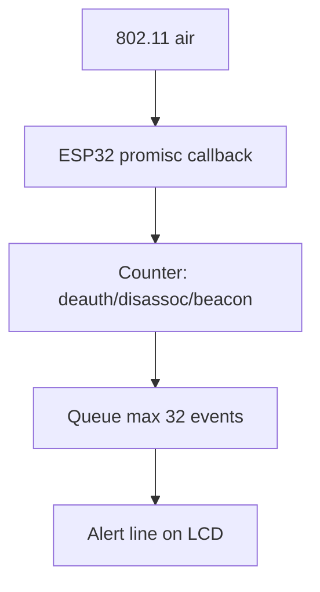

# Cardputer UTMS Wi-Fi — monorepo bridge vs M5_OS-Cardputer firmware

**Hacker Planet LLC / CyberThreatGotchi** — authorized lab kits only.

**Parent:** [UTMS_WIFI_AI.md](UTMS_WIFI_AI.md) · [CARDPUTER.md](CARDPUTER.md)

---

## Split of responsibility

| Component | Repository | Status |
|-----------|------------|--------|
| Event client (host test) | `scripts/cardputer/ctg_event_client.py` | **Shipped** |
| Status poll (legacy) | `scripts/cardputer/ctg_status.py` | **Shipped** |
| PlatformIO skeleton | `scripts/cardputer/platformio/` | **Shipped** |
| Promisc sniff firmware | **M5_OS-Cardputer** (sibling repo) | **TODO firmware** |
| UTMS pack on SD | `/utms/` path on microSD | Pull from `Backups/ctg-utms-broadcast` |

Monorepo does **not** embed full promisc driver — document and stub only.

---

## Host-side test (before flash)

```powershell
cd C:\Users\Owner\Programs\Hacker Planet LLC\cyberThreatGotchi
```

```powershell
.\scripts\windows\Start-CtgEventBus.ps1
```

```powershell
python scripts\cardputer\ctg_event_client.py --watch --host 127.0.0.1 --port 8766
```

---

## Firmware TODOs (M5_OS-Cardputer)

- [ ] **Promisc mode** — ESP-IDF Wi-Fi promisc callback; count beacon/deauth subtypes only (no injection)
- [ ] **Event POST** — optional HTTP POST to Windows `127.0.0.1:8766` via lab AP (not over internet)
- [ ] **Display tile** — show `analyst_summary` + severity color (128×128)
- [ ] **UTMS pack loader** — read `utms-broadcast-manifest.json` from SD; verify signature when Pro key configured off-device
- [ ] **Power** — deep sleep between polls; wake on button or deauth counter threshold
- [ ] **CTG_HOST config** — SD file `/config/ctg_host.txt` (not committed)

Reference pin map: existing M5Unified / LovyanGFX setup in `scripts/cardputer/platformio/src/main.cpp`.

---

## Promisc design (honest limits)



- **Cannot:** full PCAP, enterprise WIDS, encrypted payload inspection
- **Can:** spike detection, SSID/BSSID from mgmt frames, lab alert UX

---

## OTA threat pack on SD

1. Windows: `Start-CtgUtmsThreatBroadcast.ps1`
2. Copy `Backups\ctg-utms-broadcast\*` to Cardputer microSD `/utms/`
3. Firmware verifies `pack_sha256` against manifest (signature when Pro signing enabled)

Example pack: `scripts/utms/threat_pack.example.json` — lab IOCs only (RFC5737, `.invalid` domains).

---

## Manual flash steps

1. USB **COM13** (Espressif VID) — not CH9102 COM15
2. PlatformIO from `scripts/cardputer/platformio/` or M5_OS-Cardputer canonical tree
3. microSD FAT32 — `/apps/`, `/home/default/utms/`
4. Set `CTG_HOST` to lab AP gateway IP

---

## Security

- No evil twin or deauth transmit in firmware
- No secrets in git — lab Wi-Fi PSK in Kali `lab-wifi.conf` only
- Preserve user DuckDuckGo VPN on phone; Cardputer is lab segment only
