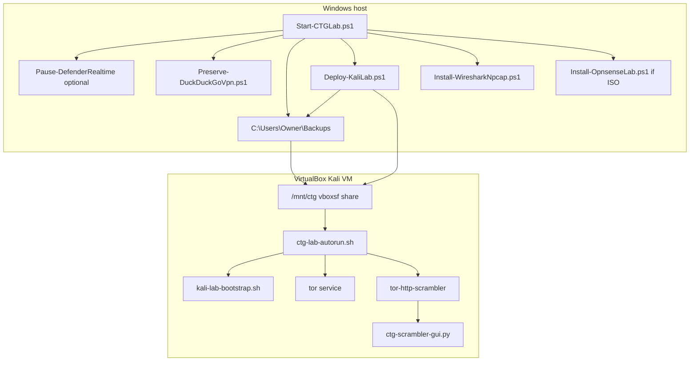

# CTG Lab Autorun — Windows + Kali one-command orchestration

**Author:** Andy Kowal · **Organization:** [Hacker Planet LLC](https://salvador-Data.github.io/cyberThreatGotchi/) (Philadelphia, PA)  
**Authorized use:** Systems and networks you own or have written scope to test. No third-party attack automation, illegal reg bypass, or law-enforcement evasion.

This document ties together the **Windows SOC host** autorun and the **Kali in-guest** autorun for the CyberThreatGotchi defensive lab.

---

## Architecture



**Defaults (when checklist not specified):**

| Setting | Default |
|---------|---------|
| Browser anonymity | Tor mode (scrambler); Tor Browser manual launch |
| DuckDuckGo preserve | ON (`--preserve-ddg-dns`) |
| WiFi profile | `company-lab` (Option 2) |
| SIEM / Shield | High-severity y/n rotate v1 (`siem-hook.sh` + `ctg-shield-rotate.sh`) |
| MAC rotate | USB wlan only (`ctg-shield-rotate.sh` — SIEM/GUI y/n v1) |
| Lab targets | `lab-targets.example` → `/etc/ctg/lab-targets.conf` |

---

## Windows — one command

From an **elevated** PowerShell (recommended for Defender pause during deploy):

```powershell
cd C:\Users\Owner\Projects\cyberThreatGotchi
```

```powershell
.\scripts\windows\Start-CTGLab.ps1
```

**Flags:**

| Flag | Effect |
|------|--------|
| `-SkipDefender` | Do not pause/resume Defender |
| `-SkipOpnsense` | Skip OPNsense VM helper |
| `-FullBootstrap` | Log full bootstrap intent (deploy passes `--install-scrambler`) |
| `-WhatIf` | Log only, no changes |

**Log:** `C:\Users\Owner\Backups\logs\ctg-lab-autorun.log`

**Order:** Defender pause (optional) → DDG preserve → stage scripts to Backups → `Deploy-KaliLab.ps1 -StartVmIfStopped` → Wireshark (non-blocking) → OPNsense if ISO in Downloads (non-blocking) → Kali GUI instructions → Defender resume.

---

## Kali boot autopatch (every boot)

Fixes common VirtualBox Kali boot errors automatically: Guest Additions packages, GDM Wayland blank screen, broken CTG `profile.d` hooks, failed systemd units, journal error scan, optional `apt full-upgrade`.

**Windows deploy** (stages scripts to `C:\Users\Owner\Backups`, adds VirtualBox share `ctg-backups`, VRAM fix, starts VM, SSH install when ready):

```powershell
cd C:\Users\Owner\Projects\cyberThreatGotchi
```

```powershell
.\scripts\windows\Deploy-KaliBootAutopatch.ps1 -RunBlankScreenFix -StartVmIfStopped
```

**One-time inside Kali** (if SSH did not finish):

```bash
sudo mkdir -p /mnt/ctg
sudo mount -t vboxsf ctg-backups /mnt/ctg
sudo bash /mnt/ctg/kali-boot-autopatch.sh --install
```

Optional first run with upgrades:

```bash
sudo bash /mnt/ctg/kali-boot-autopatch.sh --install --upgrade
```

**Verify:**

```bash
systemctl status ctg-kali-autopatch.service
tail -50 /var/log/ctg-boot-autopatch.log
```

**Also runs from** `ctg-lab-autorun.sh` (fix-only, no `--upgrade` unless you pass flags manually).

| Error / symptom | Autopatch action |
|-----------------|------------------|
| Blank GNOME desktop after login | `WaylandEnable=false` in GDM; disable CTG `profile.d` hooks |
| Missing Guest Additions X11 | Install `virtualbox-guest-x11`, `virtualbox-guest-utils`, `dkms` |
| CTG login `read` prompt hang | Disable `/etc/profile.d/ctg-*-autostart.sh` |
| Failed non-critical systemd units | Safe restart + `systemctl reset-failed` |
| Boot driver/firmware errors in journal | Logged; `--firmware` installs `firmware-linux-nonfree` |
| `ctg-backups` share not mounted | Mount hint + `/mnt/ctg` symlink if auto-mount present |
| DuckDuckGo DNS configured | **Never overwritten** when `94.140.14.14/15.15` in `resolv.conf` |

**Log:** `/var/log/ctg-boot-autopatch.log` · **Service:** `ctg-kali-autopatch.service`

**WiFi lab phase (optional):**

```bash
sudo bash /mnt/ctg/kali-boot-autopatch.sh --wifi-lab
```

Runs `ctg-wifi-lab-autorun.sh` after Guest Additions fix. Also invoked from `ctg-lab-autorun.sh` by default.

---

## WiFi + Ethernet lab autorun

USB **Realtek** dongle detect, OOT driver (`rtl8812au`), WPA2 connect from `/etc/ctg/lab-wifi.conf`, **eth promisc** when CAT5 link is up, optional **WiFi monitor** (`airmon-ng`).

**Professor answer:** Wired Ethernet uses **classic promisc**; WiFi 802.11 capture needs **monitor mode** — see [KALI_WIFI_ETH_PROMISC.md](KALI_WIFI_ETH_PROMISC.md).

**Windows staging:** `Deploy-KaliLab.ps1` copies `ctg-wifi-lab-autorun.sh` and `lab-wifi.conf.example` to `C:\Users\Owner\Backups\`.

**Kali config (once):**

```bash
sudo cp /mnt/ctg/lab-wifi.conf.example /etc/ctg/lab-wifi.conf
sudo chmod 600 /etc/ctg/lab-wifi.conf
sudo nano /etc/ctg/lab-wifi.conf
```

```bash
sudo bash /mnt/ctg/ctg-wifi-lab-autorun.sh
```

802.11 lab capture:

```bash
sudo CTG_WIFI_MONITOR=1 bash /mnt/ctg/ctg-wifi-lab-autorun.sh --monitor
```

**Boot service (optional):** `sudo bash /mnt/ctg/ctg-wifi-lab-autorun.sh --install` → `ctg-wifi-lab.service`  
**Log:** `/var/log/ctg-wifi-lab.log`

---

## Network IDS/IPS + ClamAV autorun

**Suricata-primary** IDS (detect-only on boot), optional Snort coexist, **ClamAV** (daemon + daily `/home` scan). Optional inline IPS: `--EnableIPS` (lab VLAN only — see doc).

**Professor answer:** **IDS** = log alerts on the lab interface; **IPS** = inline block via NFQUEUE (opt-in). Perimeter IPS remains **OPNsense Suricata**.

Full reference: [KALI_IDS_IPS_CLAMAV.md](KALI_IDS_IPS_CLAMAV.md) · SIEM: [KALI_SIEM_STACK.md](KALI_SIEM_STACK.md)

**One-liner in VM (8 GB — optimized):**

```bash
sudo bash /mnt/ctg/ctg-ids-ips-autorun.sh --install --optimize --skip-snort
```

**Boot autopatch chain:**

```bash
sudo bash /mnt/ctg/kali-boot-autopatch.sh --wifi-lab --ids-ips --siem --install
```

`ctg-lab-autorun.sh` runs `--ids-ips` via autopatch and calls `ctg-ids-ips-autorun.sh --optimize --skip-snort` plus `ctg-siem-autorun.sh`.  
**Logs:** `/var/log/ctg-snort/` · **Services:** `ctg-ids-ips.service`, `ctg-suricata.service` · **ClamAV:** `ctg-clamav-scan.timer`

---

## SIEM export (Wazuh / JSON aggregator)

Recommended for 8 GB Kali VM: **Wazuh agent** (when `CTG_WAZUH_MANAGER` set) + **local JSON export** — not Splunk on the VM.

```bash
sudo bash /mnt/ctg/ctg-siem-autorun.sh --install
```

Windows tail: `Backups\logs\siem\ctg-siem-latest.json`

Full comparison: [KALI_SIEM_STACK.md](KALI_SIEM_STACK.md) · Shield hook: [CTG_SHIELD_SIEM_PLAYBOOK.md](CTG_SHIELD_SIEM_PLAYBOOK.md)

---

## Kali — one command

After shared folder mount (VirtualBox `ctg` or `ctg-backups` → `/mnt/ctg`) or SSH staging:

```bash
sudo bash /mnt/ctg/ctg-lab-autorun.sh
```

**What it does:**

1. Runs `kali-boot-autopatch.sh --wifi-lab` then `ctg-wifi-lab-autorun.sh` (when staged on share)
2. Runs `kali-lab-bootstrap.sh` once (marker: `/var/lib/ctg/kali-bootstrap.done`)
3. `systemctl start tor`
4. Starts `scrambler-daemon.sh` (default mode **tor**)
5. Prints GUI and SIEM commands

**Scrambler GUI:**

```bash
python3 /opt/ctg/tor-http-scrambler/ctg-scrambler-gui.py
```

Desktop entry: **CTG .TOR/HTTP Scrambler**

**Shield (USB wlan IP/MAC):**

```bash
sudo /opt/ctg/tor-http-scrambler/ctg-shield-rotate.sh status
```

```bash
sudo /opt/ctg/tor-http-scrambler/ctg-shield-rotate.sh rotate
```

**SIEM hook (high severity → y/n rotate):**

```bash
sudo /opt/ctg/tor-http-scrambler/siem-hook.sh
```

Playbook: [CTG_SHIELD_SIEM_PLAYBOOK.md](CTG_SHIELD_SIEM_PLAYBOOK.md) · [CTG_TOR_HTTP_SCRAMBLER.md](CTG_TOR_HTTP_SCRAMBLER.md)

**Windows host status (read-only):**

```powershell
.\scripts\windows\CTG-Shield-Status.ps1
```

---

## Phase 7 — CTG Privacy Router

See [KALI_LAB_ARCHITECTURE.md](KALI_LAB_ARCHITECTURE.md) § Phase 7. Components live in `scripts/kali/tor-http-scrambler/`:

| File | Role |
|------|------|
| `scrambler-daemon.sh` | tor / http / auto modes; site-rules; glitch domain y/n prompt |
| `site-rules.example` | Banking → http; `.onion` → tor |
| `ctg-scrambler-gui.py` | Mode toggle, shield IP/MAC, IDS tail, leak stub |
| `ctg-shield-rotate.sh` | USB wlan IP/MAC status + rotate; DDG DNS preserve |
| `siem-hook.sh` | IDS high severity → shield y/n; SIEM log gzip prompt |
| `install-scrambler.sh` | Installs to `/opt/ctg/tor-http-scrambler` |

---

## Manual fallback

If SSH deploy fails (`Deploy-KaliLab.ps1` exit 1):

1. Mount: `sudo mkdir -p /mnt/ctg && sudo mount -t vboxsf ctg /mnt/ctg`
2. Run: `sudo bash /mnt/ctg/ctg-lab-autorun.sh`

Scripts are also copied to `C:\Users\Owner\Backups\` on every autorun.

---

## Blank screen after login (VirtualBox + GNOME)

**Symptoms:** User `sal` logs in; desktop is black/blank. SSH may still work.

**Common causes on the `kali` VM:**

| Cause | Evidence |
|-------|----------|
| VRAM too low (5 MiB default on some VMs) | `VBox.log`: `crtc set config failed`; `kali.vbox` `VRAMSize="5"` |
| GNOME on Wayland in VirtualBox | Fix forces `WaylandEnable=false` in GDM |
| Legacy CTG `profile.d` login `read` prompt | Hangs non-interactive GNOME session |
| Guest Additions X11 partial | `SVGA X11 display` / `Service is not availabe` in `VBox.log` |

**Windows (host, VM powered off):**

```powershell
cd C:\Users\Owner\Projects\cyberThreatGotchi
```

```powershell
.\scripts\windows\Fix-KaliBlankScreen.ps1
```

Sets **128 MiB VRAM**, **VMSVGA**, **3D off**, stages `C:\Users\Owner\Backups\fix-kali-blank-screen.sh`.

**Kali (TTY recovery — Ctrl+Alt+F2):**

```bash
sudo bash /mnt/ctg/fix-kali-blank-screen.sh
```

Or from staged copy:

```bash
sudo bash /mnt/ctg-backups/fix-kali-blank-screen.sh
```

(Adjust mount path for your VirtualBox shared folder name.)

Then switch back to graphical session (Ctrl+Alt+F1) or `sudo reboot`.

**CTG scrambler after recovery:** launch manually from **CTG .TOR/HTTP Scrambler** or `python3 /opt/ctg/tor-http-scrambler/ctg-scrambler-gui.py` — not via `/etc/profile.d/`.

---

## Related docs

- [KALI_LAB_ARCHITECTURE.md](KALI_LAB_ARCHITECTURE.md)
- [IPHONE_HARDENING.md](IPHONE_HARDENING.md) — DDG preserve rules
- [scripts/windows/README_WINDOWS_SOC.md](../scripts/windows/README_WINDOWS_SOC.md)
