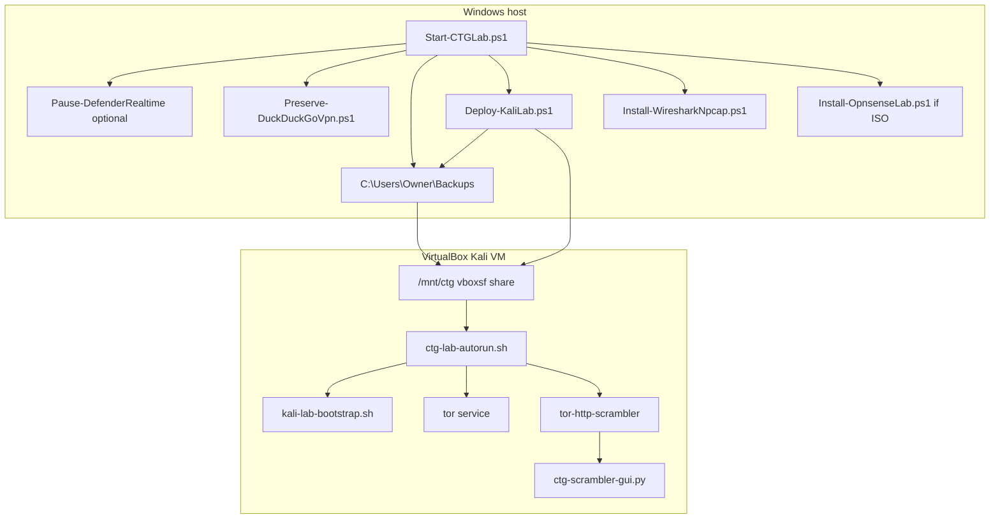

# CTG Lab Autorun — Windows + Kali one-command orchestration

**Author:** Andy Kowal · **Organization:** [Hacker Planet LLC](https://salvador-Data.github.io/cyberThreatGotchi/) (Philadelphia, PA)  
**Authorized use:** Systems and networks you own or have written scope to test. No third-party attack automation, illegal reg bypass, or law-enforcement evasion.

This document ties together the **Windows SOC host** autorun and the **Kali in-guest** autorun for the CyberThreatGotchi defensive lab.

---

## Architecture



**Defaults (when checklist not specified):**

| Setting | Default |
|---------|---------|
| Browser anonymity | Tor mode (scrambler); Tor Browser manual launch |
| DuckDuckGo preserve | ON (`--preserve-ddg-dns`) |
| WiFi profile | `company-lab` (Option 2) |
| SIEM log rotate | Prompt y/n v1 (`siem-hook.sh`) |
| MAC rotate | USB wlan only (GUI stub — not built-in NIC) |
| Lab targets | `lab-targets.example` → `/etc/ctg/lab-targets.conf` |

---

## Windows — one command

From an **elevated** PowerShell (recommended for Defender pause during deploy):

```powershell
cd C:\Users\Owner\Projects\cyberThreatGotchi
```

```powershell
.\scripts\windows\Start-CTGLab.ps1
```

**Flags:**

| Flag | Effect |
|------|--------|
| `-SkipDefender` | Do not pause/resume Defender |
| `-SkipOpnsense` | Skip OPNsense VM helper |
| `-FullBootstrap` | Log full bootstrap intent (deploy passes `--install-scrambler`) |
| `-WhatIf` | Log only, no changes |

**Log:** `C:\Users\Owner\Backups\logs\ctg-lab-autorun.log`

**Order:** Defender pause (optional) → DDG preserve → stage scripts to Backups → `Deploy-KaliLab.ps1 -StartVmIfStopped` → Wireshark (non-blocking) → OPNsense if ISO in Downloads (non-blocking) → Kali GUI instructions → Defender resume.

---

## Kali — one command

After shared folder mount (VirtualBox `ctg` → `/mnt/ctg`) or SSH staging:

```bash
sudo bash /mnt/ctg/ctg-lab-autorun.sh
```

**What it does:**

1. Runs `kali-lab-bootstrap.sh` once (marker: `/var/lib/ctg/kali-bootstrap.done`)
2. `systemctl start tor`
3. Starts `scrambler-daemon.sh` (default mode **tor**)
4. Prints GUI and SIEM commands

**Scrambler GUI:**

```bash
python3 /opt/ctg/tor-http-scrambler/ctg-scrambler-gui.py
```

Desktop entry: **CTG .TOR/HTTP Scrambler**

---

## Phase 7 — CTG Privacy Router

See [KALI_LAB_ARCHITECTURE.md](KALI_LAB_ARCHITECTURE.md) § Phase 7. Components live in `scripts/kali/tor-http-scrambler/`:

| File | Role |
|------|------|
| `scrambler-daemon.sh` | tor / http / auto modes; site-rules; glitch domain y/n prompt |
| `site-rules.example` | Banking → http; `.onion` → tor |
| `ctg-scrambler-gui.py` | Mode toggle, shield IP/MAC, IDS tail, leak stub |
| `siem-hook.sh` | Snort/syslog tail + rotate prompt (not silent WAN auto) |
| `install-scrambler.sh` | Installs to `/opt/ctg/tor-http-scrambler` |

---

## Manual fallback

If SSH deploy fails (`Deploy-KaliLab.ps1` exit 1):

1. Mount: `sudo mkdir -p /mnt/ctg && sudo mount -t vboxsf ctg /mnt/ctg`
2. Run: `sudo bash /mnt/ctg/ctg-lab-autorun.sh`

Scripts are also copied to `C:\Users\Owner\Backups\` on every autorun.

---

## Related docs

- [KALI_LAB_ARCHITECTURE.md](KALI_LAB_ARCHITECTURE.md)
- [IPHONE_HARDENING.md](IPHONE_HARDENING.md) — DDG preserve rules
- [scripts/windows/README_WINDOWS_SOC.md](../scripts/windows/README_WINDOWS_SOC.md)
