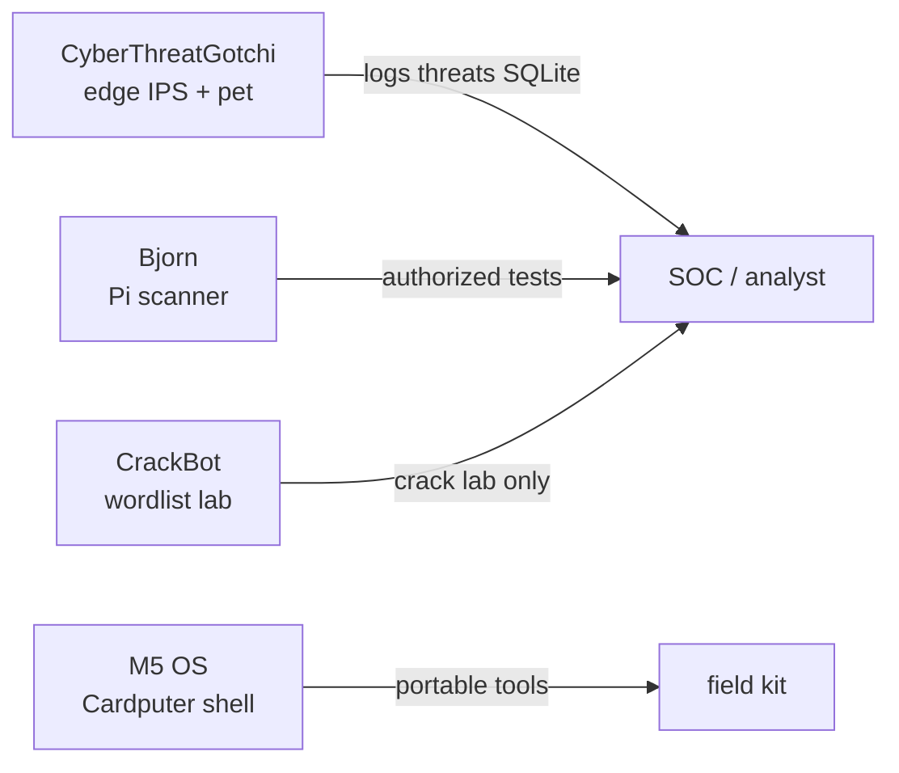

# Hacker Planet LLC — project ecosystem

CyberThreatGotchi sits alongside other **salvador-Data** repos as part of a desk-and-field security toolkit.

## Projects

| Project | Role | Hardware |
|---------|------|----------|
| **[CyberThreatGotchi](https://github.com/salvador-Data/cyberThreatGotchi)** (this repo) | Defensive edge sensor + Tamagotchi UI | Banana Pi BPI-R3 Mini |
| **[Bjorn](https://github.com/salvador-Data/Bjorn)** | Autonomous network assessment (fork of infinition/Bjorn) | Raspberry Pi + e-Paper HAT |
| **[Mr.-CrackBot-AI-Nano](https://github.com/salvador-Data/Mr.-CrackBot-AI-Nano)** | Password / wordlist lab assistant | Jetson Nano / dev PC |
| **[M5_OS-Cardputer](https://github.com/salvador-Data/M5_OS-Cardputer)** | Pocket launcher shell for Cardputer | M5Stack Cardputer (ESP32-S3) |

## How they fit together

- **CyberThreatGotchi** — always-on **defense**: capture, detect, block, log, and show Cipherhorn mood on e-ink or web.
- **Bjorn** — **authorized** red-team / assessment workflows on Pi (separate device; not bundled with CTG).
- **CrackBot** — offline or lab password generation and wordlist tooling.
- **M5 OS** — SD-based payload launcher for Cardputer field use.

There is **no hard dependency** between repos today — clone and run each independently.

## Recommended lab layout

| Location | Device | Service |
|----------|--------|---------|
| Network edge | BPI-R3 Mini | `cyberthreatgotchi` systemd |
| Assessment Pi | Raspberry Pi Zero W | `bjorn.service` |
| Bench | Laptop | CTG simulation + CrackBot tests |
| Pocket | Cardputer | M5 OS firmware |

## Author

[salvador-Data](https://github.com/salvador-Data)
