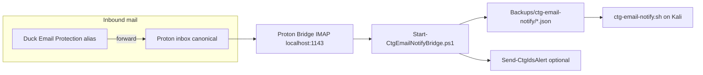

# Email notifications (Duck → Proton → Kali)

Authorized lab use — **Hacker Planet LLC**. **No email passwords or real addresses in git.**

---

## Architecture



**Single poller:** Poll **one** IMAP source (Proton Bridge on Windows). Do not poll Duck and Proton separately — forwarding would duplicate notifications.

**Dedup (Windows state file):**

1. **Primary:** RFC `Message-ID` (normalized, lowercased)
2. **Secondary:** `In-Reply-To` chain matches parent Message-ID
3. **Fallback:** SHA-256 of `From + Date + Subject + first 1KB body`

State path: `%USERPROFILE%\Backups\.vault\email-notify-state.json` (gitignored).

Kali consumer dedups again using the same keys (defense in depth).

---

## Manual setup (browser + vault — no automation)

### 1. Duck Email Protection → Proton

1. DuckDuckGo privacy dashboard → **Email Protection**
2. Create or use your `@duck.com` alias
3. Set **forward to** your Proton inbox (e.g. `your-name@proton.me`)
4. Do not store the real addresses in committed docs — use placeholders in notes

### 2. Proton Bridge (Windows)

1. Install [Proton Mail Bridge](https://proton.me/mail/bridge) (local only)
2. Sign in with your Proton account in Bridge UI — **never** commit Bridge password
3. Bridge exposes IMAP on `127.0.0.1:1143` by default
4. Keep Bridge running when the notify task is active

### 3. Vault credentials

Run diagnose for step-by-step commands:

```powershell
cd "C:\Users\Owner\Programs\Hacker Planet LLC\cyberThreatGotchi"
```

```powershell
.\scripts\windows\Initialize-CtgEmailVault.ps1 -DiagnoseOnly
```

Vault title: **`Proton IMAP`** (alternate: `CTG_EMAIL_IMAP`).

```powershell
.\scripts\windows\Ctg-CredentialVault.ps1 -UnlockVault -UseWindowsUser
```

```powershell
.\scripts\windows\Ctg-CredentialVault.ps1 -AddCredential -Title 'Proton IMAP' -Username 'YOUR_PROTON_USERNAME' -Url 'imap://127.0.0.1:1143'
```

(PowerShell prompts for Bridge mailbox password.)

### 4. DuckDuckGo Password Manager

- Use **browser extension** for web logins — do not bulk-export CSV into the repo
- Store **CTG lab-specific** credentials in `Ctg-CredentialVault.ps1` separately
- Titles: `Kali SSH`, `Proton IMAP`, optional `Microsoft Account`

### 5. Microsoft account (optional)

- Link Microsoft account for Defender/backup/Entra as you already use on the SOC laptop
- Optional vault title **`Microsoft Account`** for recovery documentation only — no tokens in git

---

## Run pipeline

### Diagnose

```powershell
.\scripts\windows\Start-CtgEmailNotifyBridge.ps1 -DiagnoseOnly -UseSecretVault
```

### Single poll

```powershell
.\scripts\windows\Start-CtgEmailNotifyBridge.ps1 -Once -UseSecretVault
```

### Scheduled task (every 5 min)

```powershell
.\scripts\windows\Register-CtgEmailNotifyTask.ps1
```

Requires Proton Bridge running at logon.

### Stage Kali script + notify folder

```powershell
.\scripts\windows\Stage-KaliLabToBackups.ps1
```

Ensure `%USERPROFILE%\Backups\ctg-email-notify` exists (created by poller).

### Kali consumer

```bash
bash /media/sf_ctg-backups/ctg-email-notify.sh
```

Or add to `RUN-KALI-LAB-NOW.sh` chain after share mount.

---

## High-priority Signal alerts

```powershell
.\scripts\windows\Start-CtgEmailNotifyBridge.ps1 -Once -UseSecretVault -SignalHighPriority
```

Matches subjects containing: urgent, critical, alert, security, breach, wazuh, ids, fail2ban (configurable in `core/ctg_email_notify.py`).

Uses `Send-CtgIdsAlert.ps1` + vault/Signal config per [SIGNAL_ALERTS.md](SIGNAL_ALERTS.md).

---

## Security notes

- **Never** commit IMAP passwords, Bridge secrets, or `.env` mail tokens
- Poller marks messages read (or move folder via `CTG_IMAP_MOVE_FOLDER`)
- Notification JSON includes subject/from preview only — no full body in share by default
- Dedup prevents double notify when the same message arrives via Duck forward and direct Proton delivery with different Message-IDs (content hash fallback)

---

## Troubleshooting

| Symptom | Check |
|---------|-------|
| No creds | `Initialize-CtgEmailVault.ps1 -DiagnoseOnly` |
| IMAP connection refused | Proton Bridge running? Port 1143? |
| Duplicates | Delete state file only if you accept re-notify of old mail |
| Kali silent | Share mounted? `ctg-email-notify/` under Backups? |
| Signal not sent | `-SignalHighPriority` + Signal configured |

Log: `%USERPROFILE%\Backups\logs\start-ctg-email-notify-bridge.log`
