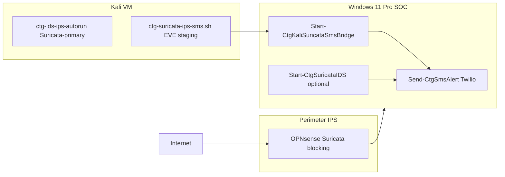

# Free IPS — Suricata vs Snort vs OPNsense (CTG lab)

**Authorized defensive use only** on networks and hosts you own or are explicitly permitted to monitor.

## Professor brief: which free IPS?

**Primary recommendation: [Suricata](https://suricata.io/)** — free, open source (GPLv2), maintained by OISF, full **IDS + IPS**, multi-threaded, EVE JSON for SIEM, Emerging Threats Open rules via `suricata-update`. Your Kali stack already runs **Suricata-primary** via `ctg-ids-ips-autorun.sh`.

| Engine | License | IPS inline | Windows native | CTG automation |
|--------|---------|------------|----------------|----------------|
| **Suricata** | Free OSS | Yes (Linux NFQUEUE, OPNsense) | MSI 7.x/8.x detect-only | **Start-CtgSuricataIDS.ps1**, Kali bridge, scheduled task |
| **Snort 2.9** | Free OSS (limited rules) | Linux only; Win = detect-only | 2.9.x + Npcap | [WINDOWS_SNORT_IDS_SMS.md](WINDOWS_SNORT_IDS_SMS.md) |
| **Snort 3** | Free OSS | Linux | **No official Windows build** | Kali / OPNsense only |
| **OPNsense Suricata** | Free (OPNsense OSS) | **Best perimeter IPS** — bridge/gateway | N/A (router VM) | GUI blocking mode + syslog |

### Why not true inline IPS on Win11 Pro laptop?

Windows lacks the clean **inline bridge + NFQUEUE** path Suricata uses on Linux. Npcap passive capture gives **detect + alert + optional host firewall block** (`-BlockRepeatOffender` via `netsh`), not wire-speed drop-in-front-of-traffic IPS. For **real inline block**, use:

1. **OPNsense VM** with Suricata plugin (blocking mode) — lab perimeter  
2. **Kali** `ctg-ids-ips-autorun.sh --EnableIPS` on **isolated lab VLAN only** (`192.168.50.0/24` default)  
3. Windows SOC: detect + SMS + optional **netsh block** for repeat external offenders

## Andy's recommended setup path



| Layer | Role | Script |
|-------|------|--------|
| **Perimeter** | Block bad traffic at gateway | OPNsense Suricata (see [OPNSENSE_LAB_DNS.md](OPNSENSE_LAB_DNS.md)) |
| **Kali** | Primary free IPS/IDS + optional inline | `sudo bash ctg-ids-ips-autorun.sh --install --skip-snort` |
| **Kali → Windows SMS** | Stage EVE to share; Twilio on host | `ctg-suricata-ips-sms.sh --install` + `Start-CtgKaliSuricataSmsBridge.ps1` |
| **Windows host** | Optional local Suricata detect-only | `Install-CtgSuricataWindows.ps1` + `Start-CtgSuricataIDS.ps1` |
| **Windows Snort** | Legacy complement detect-only | [WINDOWS_SNORT_IDS_SMS.md](WINDOWS_SNORT_IDS_SMS.md) |

## Environment variables (local `.env` only — never commit)

```env
TWILIO_ACCOUNT_SID=ACxxxxxxxxxxxxxxxxxxxxxxxxxxxxxxxx
TWILIO_AUTH_TOKEN=your_auth_token
TWILIO_FROM_NUMBER=+1xxxxxxxxxx
CTG_ALERT_SMS_TO=+1XXXXXXXXXX
```

Prefer DPAPI vault for the phone: `Protect-CtgSecrets.ps1 -SetPii -Name CTG_PII_PHONE` and `Send-CtgSmsAlert.ps1 -UseSecretVault`.

## Kali — Suricata-primary + EVE staging

Mount share, then install IDS stack:

```bash
sudo bash /media/sf_ctg-backups/ctg-mount-share.sh
```

```bash
sudo bash /media/sf_ctg-backups/ctg-ids-ips-autorun.sh --install --skip-snort --optimize
```

Stage EVE for Windows SMS bridge (every 2 min timer):

```bash
sudo bash /media/sf_ctg-backups/ctg-suricata-ips-sms.sh --install
```

Optional inline IPS (**lab VLAN only**):

```bash
sudo bash /media/sf_ctg-backups/ctg-ids-ips-autorun.sh --EnableIPS
```

Logs: `/var/log/ctg-snort/suricata-eve.json`, `suricata-fast.log`

## Windows — Suricata detect-only + SMS

Install (Administrator PowerShell — **one command per block**):

```powershell
cd C:\Users\Owner\Programs\Hacker Planet LLC\cyberThreatGotchi
```

```powershell
.\scripts\windows\Install-WiresharkNpcap.ps1
```

Download [Suricata Windows MSI](https://suricata.io/download/) or:

```powershell
.\scripts\windows\Install-CtgSuricataWindows.ps1 -InstallViaWinget
```

```powershell
.\scripts\windows\Install-CtgSuricataWindows.ps1
```

Diagnose:

```powershell
.\scripts\windows\Start-CtgSuricataIDS.ps1 -DiagnoseOnly
```

Apply config and run 2 hours:

```powershell
.\scripts\windows\Start-CtgSuricataIDS.ps1 -ApplyRules -RunMinutes 120 -Interface Wi-Fi
```

SMS test (no attack traffic):

```powershell
.\scripts\windows\Start-CtgSuricataIDS.ps1 -TestAlert
```

Kali bridge (when Suricata runs on Kali, not Windows):

```powershell
.\scripts\windows\Start-CtgKaliSuricataSmsBridge.ps1 -RunMinutes 120
```

Scheduled task at logon:

```powershell
.\scripts\windows\Register-CtgSuricataIdsTask.ps1
```

Kali bridge mode when Windows MSI not installed:

```powershell
.\scripts\windows\Register-CtgSuricataIdsTask.ps1 -UseKaliBridge
```

Optional host block for repeat external IPs:

```powershell
.\scripts\windows\Start-CtgSuricataIDS.ps1 -RunMinutes 60 -BlockRepeatOffender
```

## SMS alert format

```text
[CTG-high] CTG Suricata: [high] rule 1000001 on Wi-Fi — review log
```

Rate limit: **one SMS per rule SID per 15 minutes** (`Send-CtgSmsAlert.ps1`).

## What gets saved

| Path | Content |
|------|---------|
| `%USERPROFILE%\Backups\ctg-suricata\etc\suricata.yaml` | CTG detect-only config |
| `%USERPROFILE%\Backups\logs\suricata\eve.json` | Suricata EVE JSON |
| `%USERPROFILE%\Backups\logs\suricata\suricata-ids.log` | CTG orchestration log |
| `%USERPROFILE%\Backups\logs\kali-suricata\suricata-eve.json` | Kali-staged EVE tail |
| `%USERPROFILE%\Backups\logs\siem\ctg-siem-latest.json` | SIEM export fallback |

When SSD **D:** is online, paths use `D:\Backups\`.

## NIST / CIS mapping (defensive)

| Control | Implementation |
|---------|----------------|
| DE.CM-1 | Suricata network monitoring — Kali primary, OPNsense perimeter, Windows passive |
| DE.CM-4 | Malicious code — correlate Suricata alerts with ClamAV (`ctg-ids-ips-autorun.sh`) |
| PR.PT-1 | Secrets in `.env`/vault only; Interactive+Highest scheduled tasks |
| RS.AN-1 | SMS notifies analyst; forensics from EVE/fast logs (no payload in SMS) |

## Related docs

- [KALI_IDS_IPS_CLAMAV.md](KALI_IDS_IPS_CLAMAV.md) — Kali Suricata-primary stack  
- [WINDOWS_SNORT_IDS_SMS.md](WINDOWS_SNORT_IDS_SMS.md) — Snort 2.9 Windows complement  
- [WIRESHARK_IDS_SMS.md](WIRESHARK_IDS_SMS.md) — tshark heuristics fallback  
- [SECURITY_HARDENING.md](SECURITY_HARDENING.md) — Twilio env vars  
