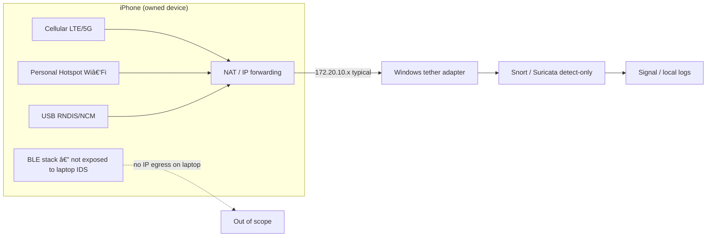

# iPhone tether egress monitoring (honest scope)

**Hacker Planet LLC / CyberThreatGotchi** — defensive lab use on devices you **own** or are **explicitly authorized** to administer.

**Related:** [IPHONE_LAPTOP_CONNECTION.md](IPHONE_LAPTOP_CONNECTION.md) · [IPHONE_HARDENING.md](IPHONE_HARDENING.md) · [WINDOWS_SNORT_IDS_SMS.md](WINDOWS_SNORT_IDS_SMS.md) · [FREE_IPS_SURICATA.md](FREE_IPS_SURICATA.md) · [SIGNAL_ALERTS.md](SIGNAL_ALERTS.md)

---

## What this is (and is not)

When your iPhone shares internet with a Windows SOC laptop (**Personal Hotspot** Wi‑Fi or **USB tether**), the laptop receives a **NAT'd IP path** through the phone. CTG can run **detect-only IDS** (Snort or Suricata) on that Windows network adapter and send **Signal** alerts for high/critical hits.

This is **monitor tether egress** — not spoofing of the phone's radios.

| Layer | Can Windows/Kali monitor from laptop? | Cannot do (illegal / impossible without jailbreak) |
|-------|--------------------------------------|-----------------------------------------------------|
| **Wi‑Fi (phone as hotspot AP)** | IP traffic **after** laptop joins hotspot; adapter heuristics + optional SSID pattern (`YourHotspotSSID`) | Rewrite iPhone Wi‑Fi MAC, impersonate phone on home LAN, decrypt WPA3 for third parties |
| **BLE** | **No IDS path** — BLE stays on phone SoC; optional **passive lab inventory** only (Apple continuity beacons nearby) | Spoof iPhone BLE identity, inject pairing, "be" the phone over BLE from laptop |
| **Cellular (LTE/5G)** | **NAT'd IP only** on tether/hotspot hop — same as any upstream gateway | Spoof modem/IMSI/ICCID, intercept carrier air interface, SIM clone from laptop |

**Preserve DuckDuckGo VPN/DNS on the phone.** Tether monitoring does not replace or disable DDG VPN; complete the read-only checklist before capture sessions.

---

## Traffic path (diagram)



ASCII equivalent:

```
iPhone [Cellular | Hotspot Wi-Fi | USB tether]
              |
              v  (NAT — laptop never sees LTE/5G air interface)
Windows adapter (Wi-Fi client or Apple Mobile Device Ethernet)
              |
              v
Snort / Suricata (Npcap) + Signal alerts
```

---

## What CTG monitors vs cannot

| Observable on laptop | Snort/Suricata sees | Does not see |
|----------------------|---------------------|--------------|
| Malware C2, scans, suspicious TLS/HTTP over tether | Yes (IP/TCP/UDP payloads permitted by rules) | Encrypted app payloads inside phone before NAT |
| Hotspot client ↔ internet via phone gateway | Yes, on selected adapter | Other phones on carrier network |
| USB tether adapter traffic | Yes, on RNDIS/NCM interface | Raw USB filesystem / Trust channel |
| BLE advertisements | No (separate radio) | — |
| Cellular RRC/NAS signaling | No | — |
| Spectre / RETBleed on phone SoC | No | Patch iOS; see [SECURITY_HARDENING.md](SECURITY_HARDENING.md) |

---

## Quick start (Windows SOC)

1. On **iPhone:** enable **Personal Hotspot** (strong password) or **USB tethering**; keep **DuckDuckGo VPN** as configured.
2. On **Windows:** connect to hotspot or plug USB; trust only when you initiated the session.
3. Diagnose tether adapter detection:

```powershell
cd C:\Users\Owner\Programs\Hacker Planet LLC\cyberThreatGotchi
```

```powershell
.\scripts\windows\Start-CtgIphoneTetherIds.ps1 -DiagnoseOnly
```

4. Run IDS on detected interface (checklist + Snort/Suricata + Signal):

```powershell
.\scripts\windows\Start-CtgIphoneTetherIds.ps1 -RunMinutes 120
```

Optional SSID hint (use **your** hotspot name — placeholder only in docs):

```powershell
.\scripts\windows\Start-CtgIphoneTetherIds.ps1 -HotspotSsidPattern '^YourHotspotSSID$' -RunMinutes 60
```

Manual interface override when heuristics disagree:

```powershell
.\scripts\windows\Start-CtgIphoneTetherIds.ps1 -Interface Wi-Fi -RunMinutes 60
```

---

## Detection heuristics (no PII in repo)

`Start-CtgIphoneTetherIds.ps1` scores active adapters using:

| Signal | Meaning |
|--------|---------|
| Description matches Apple / Remote NDIS / RNDIS / NCM | USB tether adapter |
| Default gateway `172.20.10.1` (or `172.20.10.0/28`) | Common iPhone Personal Hotspot / USB DHCP |
| Wi‑Fi up + `-HotspotSsidPattern` match | Connected to your phone AP |
| Manual `-Interface` | Operator override |

It does **not** commit real hotspot SSIDs, phone numbers, or credentials.

---

## Privacy checklist integration

Before IDS capture (unless `-SkipChecklist`), the script runs:

`scripts/iphone/iphone_tethering_privacy_checklist.ps1 -DetectUsb`

That script is **read-only** — Settings paths for Private Wi‑Fi Address, Limit IP Tracking, USB Restricted Mode, DuckDuckGo VPN/DNS, and Password Manager.

---

## Kali VM (optional bridge note)

If the Kali guest uses **bridged networking** to the same tether adapter as Windows, Suricata on Kali can mirror the same **NAT egress** view. CTG does not auto-bridge VMs to phone tether.

See `scripts/kali/ctg-tether-bridge-ids.sh` for passive documentation and optional EVE staging — **authorized lab only**.

---

## Scripts

| Script | Role |
|--------|------|
| `scripts/windows/Start-CtgIphoneTetherIds.ps1` | Detect tether iface → checklist → Snort/Suricata |
| `scripts/iphone/iphone_tethering_privacy_checklist.ps1` | Read-only iPhone Settings reminders |
| `scripts/windows/Start-CtgSnortIDS.ps1` | Snort detect-only + Signal |
| `scripts/windows/Start-CtgSuricataIDS.ps1` | Suricata detect-only + Signal |
| `scripts/kali/ctg-tether-bridge-ids.sh` | Kali bridge/tap notes (doc-first) |

---

## Blue-team framing

- **CIS Control 13** — network monitoring on the egress path you control (laptop tether adapter).
- **MITRE ATT&CK** — detect command-and-control and exfil **over IP** leaving the tethered host; mapping is on **traffic**, not cellular identity spoofing.
- **Red-team awareness (lab only):** Attackers target **tethered laptops**, not the LTE radio directly from your SOC — IDS on the NAT hop is the correct defensive layer.

---

**Author:** [Hacker Planet LLC](ABOUT_HACKER_PLANET.md) · **Maintained with:** [IPHONE_HARDENING.md](IPHONE_HARDENING.md)
