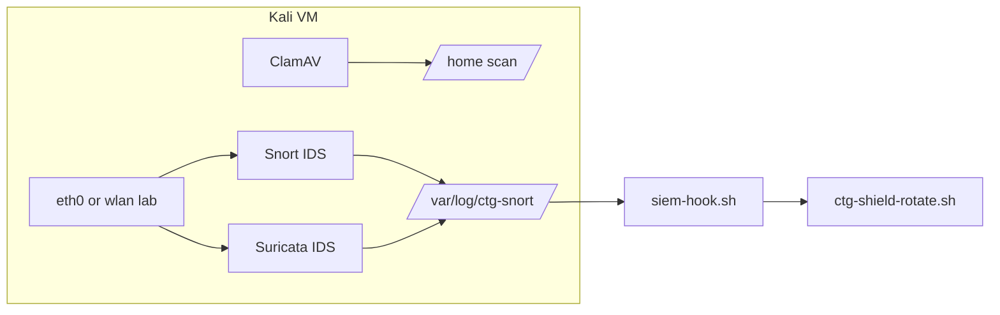

# Kali lab — Network IDS/IPS + ClamAV

**Author:** Andy Kowal · **Organization:** [Hacker Planet LLC](https://salvador-Data.github.io/cyberThreatGotchi/) (Philadelphia, PA)  
**Authorized use:** Systems and networks you own or have written scope to test.

Companion: [KALI_SIEM_STACK.md](KALI_SIEM_STACK.md) · [KALI_LAB_ARCHITECTURE.md](KALI_LAB_ARCHITECTURE.md) · [CTG_LAB_AUTORUN.md](CTG_LAB_AUTORUN.md) · [KALI_WIFI_ETH_PROMISC.md](KALI_WIFI_ETH_PROMISC.md)

---

## IDS vs IPS on Kali (honest split)

| Layer | Tool | Mode on Kali | Role |
|-------|------|--------------|------|
| **Network IDS** | **Suricata** (primary) | **Detect-only** default | Watches lab interface; EVE JSON + fast.log for SIEM |
| **Network IDS** | **Snort** (optional) | **Detect-only** coexist | Community rules only — use `--skip-snort` on 8 GB VM |
| **Network IPS** | **Suricata + NFQUEUE** | **Opt-in** (`--EnableIPS`) | Inline drop/reject on **`CTG_IPS_LAB_VLAN` only** (default `192.168.50.0/24`) |
| **Perimeter IPS** | **Suricata on OPNsense** | Production path | North-south policy at firewall — **not** replaced by Kali |
| **File AV** | **ClamAV** | Daemon + daily `/home` scan | Hardened config — OnAccess off for VM performance |

**Professor answer:** On Kali, **IDS = see and log**; **IPS = inline enforcement** (iptables NFQUEUE). Default autorun is **IDS only**. Primary home/perimeter IPS stays **OPNsense Suricata**.

---

## One-liner inside the VM

After mounting the ctg-backups share (`/mnt/ctg`):

```bash
sudo bash /mnt/ctg/ctg-ids-ips-autorun.sh --install --optimize --skip-snort
```

Full lab stack (bootstrap + WiFi/eth promisc + IDS + ClamAV):

```bash
sudo bash /mnt/ctg/ctg-lab-autorun.sh
```

Boot autopatch with WiFi + IDS:

```bash
sudo bash /mnt/ctg/kali-boot-autopatch.sh --wifi-lab --ids-ips --install
```

---

## What gets installed

### ClamAV

- Packages: `clamav`, `clamav-daemon`, `clamav-freshclam`
- Hardening: `/etc/clamav/clamd.conf.d/ctg-hardening.conf` — OnAccess off, `TCPAddr 127.0.0.1`, `MaxThreads 4`
- Services: `clamav-freshclam`, `clamav-daemon` (enabled)
- Timer: `ctg-clamav-scan.timer` — daily 03:30, lightweight `clamscan` of `/home`
- Logs: `/var/log/ctg-clamav/scan.log`

### Snort (optional passive IDS)

- Use `--skip-snort` on 8 GB VM (Suricata-primary)
- Config: `/etc/ctg/snort/snort.conf` — community rules only
- `--optimize`: lightweight stream5 + sfportscan preprocessors only

### Suricata (primary IDS / optional IPS)

- Config: `/etc/ctg/suricata/suricata.yaml` — drop privileges (`run-as: suricata`)
- Service: `ctg-suricata.service` (with `--install`)
- Logs: `/var/log/ctg-snort/suricata-fast.log`, `suricata-eve.json`
- `--optimize`: low detect profile, CPU affinity, af-packet tune, `ctg-suricata-update.timer`

**Danger:** `--EnableIPS` can block legitimate lab traffic (gaming, iCloud, VPN). Use only on an **isolated lab VLAN** with rollback plan.

---

## SIEM + CTG Shield

See [KALI_SIEM_STACK.md](KALI_SIEM_STACK.md) for Wazuh vs Splunk vs JSON export.

```bash
sudo bash /mnt/ctg/ctg-siem-autorun.sh --install
sudo /opt/ctg/tor-http-scrambler/siem-hook.sh
sudo /opt/ctg/tor-http-scrambler/ctg-shield-rotate.sh status
```

`siem-hook.sh` tails Snort/Suricata under `/var/log/ctg-snort/` and prompts **y/n** shield rotate on high-severity lines (v1 manual confirm).

---

## Systemd

| Unit | Purpose |
|------|---------|
| `ctg-ids-ips.service` | Boot oneshot — ClamAV + Suricata-primary |
| `ctg-suricata.service` | Persistent Suricata IDS |
| `ctg-clamav-scan.timer` | Daily `/home` scan |
| `ctg-suricata-update.timer` | Daily rules refresh (with `--optimize`) |

Install: `sudo bash ctg-ids-ips-autorun.sh --install`

---

## Environment

| Variable | Default | Meaning |
|----------|---------|---------|
| `CTG_IPS_LAB_VLAN` | `192.168.50.0/24` | Source CIDR for NFQUEUE when `--EnableIPS` |
| `CTG_IPS_NFQUEUE` | `0` | NFQUEUE number for Suricata inline |
| `CTG_IPS_ENABLE` | unset | Set `1` in unit env to enable IPS on boot (not default) |
| `CTG_WIFI_MONITOR` | `0` | WiFi monitor mode (separate script — see promisc doc) |

---

## Architecture sketch



---

*Defensive security engineering — Hacker Planet LLC · Authorized lab use only.*
