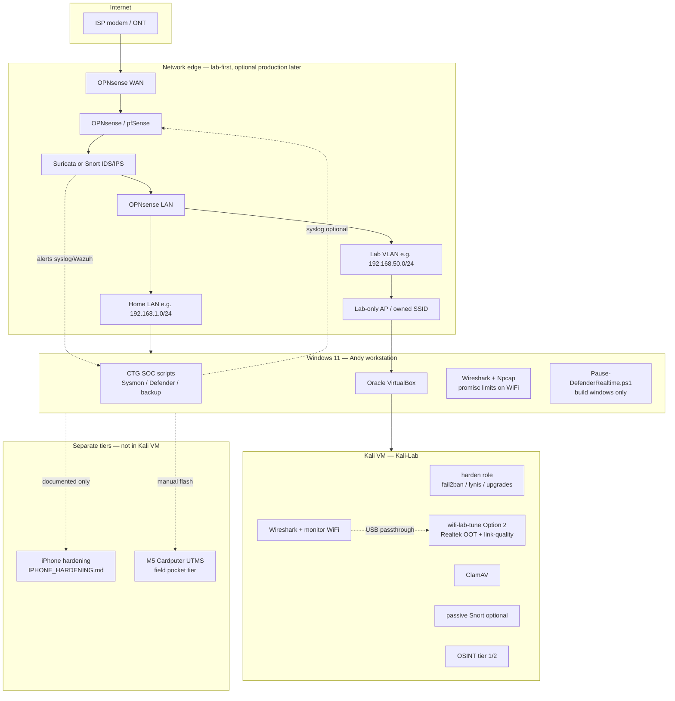

# Kali Lab Architecture & Bootstrap Plan

**Author:** Andy Kowal · **Organization:** [Hacker Planet LLC](https://salvador-Data.github.io/cyberThreatGotchi/) (Philadelphia, PA)  
**GitHub:** [salvador-Data](https://github.com/salvador-Data) · **Repo:** [CyberThreatGotchi](https://github.com/salvador-Data/cyberThreatGotchi)

**Status:** Architecture and phased rollout plan only — **no VM install, no firewall replacement, and no destructive automation** until Andy explicitly runs each phase.  
**Companion:** [PORTFOLIO_SYSTEM_HARDENING.md](PORTFOLIO_SYSTEM_HARDENING.md) (Windows SOC, iPhone, Cardputer UTMS) · [scripts/windows/README_WINDOWS_SOC.md](../scripts/windows/README_WINDOWS_SOC.md)

**Hacker Planet LLC — company defensive lab (authorized use):** This architecture describes **Hacker Planet LLC**’s authorized security research and defensive engineering lab (Philadelphia, PA). WiFi and RF work stays on **company-owned, lab-isolated** segments with written RF policy sign-off — not on neighbors’, coffee-shop, or client production WLANs without explicit scope.

---

## Authorized use (read first)

This lab stack is for **systems and networks you own** or are **explicitly permitted** to test (Hacker Planet LLC company lab, personal homelab, CTG development, future MSP kit narratives, coursework with written scope). It is **not** for:

- Scanning or attacking neighbors, coffee-shop, or corporate WiFi without authorization
- Evading law enforcement or bypassing paywalls/licensing illegally
- Replacing a family ISP router **without** a rollback plan and household agreement
- Regulatory domain bypass, illegal amplifiers, jamming, or instructions to “disable FCC limits” (documented **nowhere** in this repo — see [What this doc does NOT cover](#what-this-doc-does-not-cover))

**Default WiFi strategy (Andy / Hacker Planet lab):** **Option 2 — company lab** (`--wifi-profile=company-lab`): driver/firmware + link-quality + lab-isolated RF tuning on a **dedicated lab-only AP/VLAN**, within **legal** TX and regdomain. Option 1 remains for home/conservative use only.

---

## Stack overview

| Layer | Component | Role in Andy’s lab |
|-------|-----------|-------------------|
| **Analyst workstation** | Kali Linux VM (hardened) | Offensive-security **tooling** in an isolated VM — packet capture, OSINT, malware analysis prep, WiFi lab with USB dongle |
| **Production / lab firewall** | **OPNsense** (preferred) or pfSense | North-south policy, NAT, VLANs, **Suricata** (or Snort) IDS/IPS at the **perimeter** — not Kali |
| **Network IDS/IPS** | Suricata/Snort on **firewall** | Production path: inline or bridged on OPNsense; start **detect-only**, tune, then selective block |
| **Optional host IDS** | Passive Snort on Kali | Lab-only tap/mirror of a span port — **not** inline on home internet day one |
| **File AV** | ClamAV on Kali | Scan downloads, malware samples, extracted archives — **not** a network UTM replacement |
| **Packet analysis** | Wireshark (+ tshark) | Windows host for daily capture; Kali for **monitor mode** WiFi with passthrough dongle |
| **WiFi lab** | Realtek USB dongle + **Option 2** tune (default) | Monitor mode, lab-only AP/VLAN, link-quality tuning — authorized SSIDs only |
| **OSINT** | Tier 1/2 FOSS toolchain | Recon on **permitted** targets (your domains, bug-bounty scope, customer written ROE) |
| **Windows host** | CTG hardening scripts | Sysmon, HWS audit, Defender, backups, Defender pause for builds, VirtualBox Kali VM |
| **Bootstrap** | Ansible (Kali) + PowerShell (Windows) | Repeatable roles after gold ISO install — idempotent, reviewable |

**Design principle:** Kali is an **analyst knife**, not the **household router**. OPNsense (or a future mini-PC appliance) is the **edge**.

---

## Architecture diagram



**ASCII (operations view):**

```
[Internet] → OPNsense WAN → [Suricata/Snort] → LAN
                              ├─ Home VLAN  → family WiFi / Windows (CTG scripts)
                              └─ Lab VLAN   → lab-only AP → VirtualBox → Kali-Lab VM
Windows: Wireshark/Npcap (limited WiFi promisc) | VirtualBox | Install-KaliVirtualBox.ps1
Kali VM: ClamAV (files) | optional passive Snort | OSINT | USB Realtek monitor (Option 2 default)
```

---

## Component detail

### Kali VM (hardened analyst workstation)

- **Hypervisor:** Oracle VirtualBox on Windows (existing reference: `scripts/windows/Install-KaliVirtualBox.ps1`).
- **Default sizing (recommended):** 8 GB RAM, 2–4 vCPU, 40–60 GB disk — **not** 34 GB RAM or oversized VDI on a daily-driver laptop.
- **Install path:** Official Kali **installer** ISO (not the VirtualBox-only OVA if you want repeatable preseed/Ansible).
- **Post-install hardening (Ansible `harden` role):** non-root sudo, SSH key-only (if SSH enabled at all), `fail2ban`, `lynis` audit, `unattended-upgrades`, firewall default-deny with explicit allow for lab work, remove unnecessary services.
- **Credentials:** Generated by install script → `C:\Users\Owner\Backups\kali-vm-credentials.txt` (and gitignored password file for VBox unattended) — **never** commit to repo.

### OPNsense / pfSense (production firewall)

- **Preferred:** OPNsense (Suricata integration, Andy’s documented stack in `README_WINDOWS_SOC.md`).
- **pfSense:** Acceptable alternative; same architecture slot.
- **Phased placement:**
  1. **Lab-only:** OPNsense VM or spare NIC on **lab VLAN** — learn rulesets without touching family DHCP/DNS.
  2. **Optional edge (`--edge-mode`):** Only after config export, rollback ISP modem bridge plan, and household window — see [Rollback & edge mode](#rollback--edge-mode-opt-in).

### IDS/IPS placement

| Location | Mode | When |
|----------|------|------|
| **OPNsense Suricata** | Detect-only → alert → selective block | P3 — primary production IDS |
| **OPNsense inline IPS** | Block after tuning | After false-positive review |
| **Kali passive Snort** | Tap/SPAN or mirrored port | Optional lab exercise — never sole perimeter |
| **Windows** | Sysmon (host IDS telemetry) | Already in CTG SOC — complements network IDS |

**When NOT to use Kali as firewall:** Kali is not designed for 24/7 NAT/DHCP/DNS for a household, lacks vendor support for edge HA, and increases blast radius if analyst tools are compromised. Use OPNsense/pfSense or a **physical mini-PC** for true production edge.

### ClamAV on Kali

- **Scope:** On-access or on-demand scanning of analyst working directories (`~/samples`, `~/downloads`), `freshclam` updates.
- **Not in scope:** Inline HTTP/SMTP AV gateway (that is UTM/appliance territory — CTG Banana Pi narrative is separate hardware).

### Wireshark & WiFi lab

- **Windows:** Wireshark + Npcap — fine for Ethernet and many USB adapters; **WiFi monitor mode on Windows is limited** (driver/Npcap constraints).
- **Kali VM:** Primary home for **802.11 monitor mode** when Realtek USB dongle is passed through via VirtualBox.
- **Bootstrap default:** `ansible-playbook site.yml --wifi-profile=company-lab` (Option 2). Use `--wifi-profile=home-conservative` only when intentionally minimizing RF changes on a shared home LAN.

### WiFi lab profiles

| Profile | CLI flag | When to use | What automation does |
|---------|----------|-------------|----------------------|
| **Option 1 — Home/conservative** | `--wifi-profile=home-conservative` | Shared home LAN, travel laptop, minimal RF footprint | Reg domain + **max legal TX** for configured country (`iw reg set`), minimal package/driver changes, `power_save` left default unless capture unstable |
| **Option 2 — Company lab (DEFAULT for Andy)** | `--wifi-profile=company-lab` | Hacker Planet LLC defensive lab — **isolated from production home LAN** | Realtek **out-of-tree** driver role when `lsusb` matches; `power_save off`; **fixed lab channel** on owned AP; `wifi-lab-baseline.sh` scan baseline; attempt **PHY max TX within legal tables** where driver/firmware exposes it (no regdomain bypass); **link-quality** tuning (`iw`/`iwconfig` where applicable); monitor-mode path documented; USB passthrough checklist enforced |

**Option 2 lab RF prerequisites (human, not Ansible):**

1. **Dedicated lab-only AP/VLAN** — e.g. `LAN_LAB` + SSID `HP-LAB-80211` — **no bridge** to family `LAN_HOME` until rules proven.
2. **Company RF policy sign-off** — written note in lab journal: authorized band, max EIRP per FCC/ETSI for your install, no outdoor omnidirectional “reach the block” tests.
3. **Shielded / isolated segment** — basement bench, Faraday bag for sensitive captures, or RF-attenuated room when reproducing exploit PoCs.
4. **Owned lab AP** — spare router flashed with OpenWrt/OPNsense AP mode or VLAN-tied SSID you control — never the neighbor’s SSID.

**Corporate authorized-use header (Option 2 only):** WiFi lab work under this profile is **Hacker Planet LLC defensive security engineering** on company-owned infrastructure. Targets are lab APs, CTG dev SSIDs, and **written-scope** customer ROE — not opportunistic wardriving.

### What this doc does NOT cover

The following are **intentionally excluded** from architecture, Ansible roles, and portfolio links — even for the company lab:

| Excluded | Why |
|----------|-----|
| Reg domain bypass / “unlock” country codes | Illegal or ToS-violating in many jurisdictions |
| Illegal amplifiers, high-gain illegal radiators | FCC/ETSI enforcement risk; out of defensive lab scope |
| Jamming, deauth floods against third parties | Federal crime; not authorized defensive testing |
| “Disable FCC limits” firmware or CRDA hacks | Replaced by **legal** driver TX tables + isolated lab RF |

**Instead document and implement:** isolated lab network, company RF policy sign-off, shielded/isolated segment, **owned lab AP**, detect-only IDS before block, and rollback artifacts.

### Realtek USB WiFi dongle

- **Workflow:** Identify chipset on Windows (`usbview`/Device Manager) and Kali (`lsusb`, `dmesg`) before driver role runs.
- **Common path:** `rtl88xxau` / `rtl8812au` family drivers — role installs only after `lsusb` ID match (see [Realtek identification](#realtek-usb-identification-workflow)).
- **VirtualBox:** USB 2.0/3.0 controller enabled, filter for vendor/product ID, attach **after** VM boot; expect to detach from Windows (Wireshark on host stops seeing that adapter).

### OSINT tier 1 / tier 2

| Tier | Tools (examples) | Notes |
|------|------------------|-------|
| **Tier 1 — passive / low touch** | `theHarvester`, Amass (passive), `whois`, `dig`, `curl`, built-in Kali menus | API keys via env — see [Secrets](#secrets-and-api-keys) |
| **Tier 2 — orchestration** | recon-ng, SpiderFoot (optional), Maltego **CE** | Maltego CE requires **manual** install step (Java, EULA, transform hub) |

### Windows host companion

- **CTG SOC:** `harden_windows.ps1`, `ctg_soc_run_once.ps1`, Sysmon, selective backup, nightly `ctg_nightly_4am.ps1` — align syslog forward targets when OPNsense exists.
- **Defender:** `Pause-DefenderRealtime.ps1` for PlatformIO/Cardputer builds only — not a permanent disable.
- **VirtualBox Kali:** `Install-KaliVirtualBox.ps1` — creates VM, unattended install, credentials to Backups.
- **OPNsense lab VM:** Planned `Install-OpnsenseLab.ps1` — reference only in P2; installs local lab appliance, **not** edge by default.

### Auto bootstrap (target state)

**Preferred:** Ansible playbook applied **inside** Kali (or via `ansible localhost`) after first boot.

**Default invocation (Andy / Hacker Planet lab):**

```bash
cd ~/cyberThreatGotchi/scripts/kali   # when playbooks land in repo
ansible-playbook playbooks/site.yml --wifi-profile=company-lab
```

| Flag | Maps to | Default |
|------|---------|---------|
| `--wifi-profile=company-lab` | Option 2 — driver/firmware, link-quality, lab-isolated RF | **Yes (Andy)** |
| `--wifi-profile=home-conservative` | Option 1 — regdomain + legal max TX only | Opt-in |

| Role | Purpose |
|------|---------|
| `harden` | fail2ban, lynis, unattended-upgrades, ssh hardening, ufw/nft baseline |
| `clamav` | clamav, freshclam, scan paths |
| `snort-ids` | passive Snort + local rules sync (optional) |
| `osint` | apt packages: theHarvester, amass, recon-ng, etc. |
| `realtek-driver` | chipset-conditional Realtek **out-of-tree** DKMS (88xxau / 8812au family) |
| `wifi-lab-tune` | Profile-aware: Option 2 = `power_save off`, fixed channel vars, scan baseline, legal regdomain + driver TX where supported; Option 1 = regdomain + legal TX only |

**Windows reference scripts (no destructive default):**

- `scripts/windows/Install-KaliVirtualBox.ps1` — exists
- `scripts/windows/Install-OpnsenseLab.ps1` — proposed; lab VM only, `-EdgeMode` switch gated

---

## Phased rollout (P0–P6)

| Phase | Name | Goals | Automation | Human gates |
|-------|------|-------|------------|-------------|
| **P0** | Inventory | Document NICs, disk space, ISOs, dongle `lsusb` ID, current gateway, VLAN plan, **WiFi profile choice** | None required | Andy confirms legal scope, **company RF policy**, family impact |
| **P1** | Kali harden | Gold Kali VM, snapshots, Ansible `harden` + `clamav` | `Install-KaliVirtualBox.ps1`, Ansible | Review Lynis report; snapshot before changes |
| **P2** | Network / WiFi | Lab VLAN + **lab-only AP** on OPNsense; Realtek passthrough; `wifi-lab-tune` with **`--wifi-profile=company-lab`** | `Install-OpnsenseLab.ps1` (lab), Ansible roles | **Do not** move family DHCP day one; confirm isolated RF segment |
| **P3** | IDS | Suricata on OPNsense detect-only; syslog to Wazuh/CTG logs | OPNsense UI + export playbook doc | Tune rules 1–2 weeks before block mode |
| **P4** | OSINT | Tier 1 apt; Maltego CE manual; API keys in env | Ansible `osint` partial | Maltego EULA, Shodan/Censys ToS |
| **P5** | Windows companion | Wireshark/Npcap verify, CTG SOC syslog target, backup manifests | Existing CTG scripts + doc | Align nightly backup with OPNsense XML export |
| **P6** | Production edge & SOC maturity | Optional mini-PC OPNsense edge; Security Onion evaluation; MSP kit narrative export | Documented XML migration; syslog fan-in | `-EdgeMode` only after P3+P5 stable; spouse/ISP rollback rehearsed |

---

## Professor extras (Andy may not have thought of)

### Separate lab VLAN vs production home LAN

- Create **`LAN_LAB`** (e.g. `192.168.50.0/24`) with its own **lab-only AP** SSID (owned hardware) or isolated switch port — **production home LAN stays on `LAN_HOME`**.
- Keep **`LAN_HOME`** on current subnet until P3/P5 prove stable.
- Run Ansible WiFi roles with **`--wifi-profile=company-lab`** only when Kali is on **lab VLAN / lab AP** — switch to `home-conservative` if you must sniff from a shared home SSID (discouraged).
- VirtualBox Kali can use **NAT** (simplest) or **bridged to lab VLAN only** (better for realistic sniffing) — never bridge Kali to home VLAN until hardening complete.

### Backup & rollback artifacts

| Artifact | Method | Storage |
|----------|--------|---------|
| Kali VM | VirtualBox snapshot + export OVA quarterly | `C:\Users\Owner\Backups` / OneDrive |
| OPNsense | **System → Configuration → Backup** XML | `Backups\opnsense-config-YYYY-MM-DD.xml` (gitignored) |
| Credentials | Install script output | `Backups\kali-vm-credentials.txt` (gitignored) |
| Ansible | Playbook in repo | Git tracks **no** secrets |

Align with **`ctg_nightly_4am.ps1`** — Projects + Backups already in nightly scope.

### Logging / SOC alignment with CTG

- **Windows:** Sysmon → Wazuh (when `CTG_WAZUH_MANAGER` set); `ctg_soc_run_once.ps1` logs to Desktop + `D:\Backups\` when SSD online.
- **OPNsense:** Send Suricata alerts via syslog to Wazuh or a dedicated `rsyslog` receiver — document IP/port in `SECURITY_HARDENING.md` when live.
- **Kali:** Forward `auth.log`, `fail2ban`, and optional Snort alerts to same manager — **lab VLAN source IP only**.

### Secrets & API keys

| Secret | Store | Never |
|--------|-------|-------|
| Shodan, Censys, VirusTotal, SecurityTrails | `/etc/environment.d/` or `~/.config/ctg-osint.env` (mode 600) | Repo, wiki, Discord |
| Maltego keys / transform hub | Maltego app config | Commit |
| OPNsense API | `Backups\opnsense-api.key` gitignored | Slack |
| Kali VM password | `Backups\` via install script | Git |

Pattern matches CTG: `CTG_WEB_API_TOKEN`, `CTG_WAZUH_MANAGER` — env-only.

### Host hardening on Kali (beyond “it’s Kali”)

- `fail2ban` on SSH (if enabled)
- `lynis audit system` monthly
- `unattended-upgrades` for security patches
- Separate **analyst** user vs daily driver — avoid browsing email in same profile as malware samples

### RAM / disk sizing (honest)

| VM / appliance | RAM | Disk | Notes |
|--------------|-----|------|-------|
| Kali-Lab | **8 GB** (4 GB min PoC) | 40–60 GB | Install script default 4096 MB — **bump to 8192** before heavy Wireshark |
| OPNsense lab VM | 2–4 GB | 16–32 GB | Two NICs virt or physical |
| OPNsense production mini-PC | 4 GB | 32 GB SSD | AES-NI NIC preferred |
| Wazuh manager (optional) | 8 GB+ | 100 GB+ | Future heavy SOC — see Security Onion |

**Do not** allocate 34 GB RAM to Kali on a 16–32 GB host — Windows and VirtualBox need headroom.

### VirtualBox USB passthrough checklist

1. Install **VirtualBox Extension Pack** (same version as VBox).
2. VM Settings → USB → enable USB 2.0 or 3.0 controller.
3. Add **USB device filter** for Realtek vendor:product (from `lsusb` on live boot USB or Windows Device Manager).
4. Boot Kali → attach dongle to VM (Devices menu) — Windows host releases device.
5. Verify: `lsusb`, `iw dev`, `ip link`, `aireplay-ng --test` only on **your** lab AP.
6. If attach fails: close Wireshark/Npcap binding on Windows, run VBox as admin once to test.

### IPS: detect-only before block

1. Enable Suricata with **IPS mode off** (IDS only).
2. Log to OPNsense + remote syslog for 7–14 days.
3. Classify false positives (gaming, DNS, iCloud, DuckDuckGo VPN on phone).
4. Enable **drop/reject** only on curated rule categories.
5. Document **incident response** when alert fires (below).

### Maltego CE — manual install step

Ansible **`osint` role must not** silently accept Maltego EULA. Manual steps:

1. Install OpenJDK 17+ and `wget` download Maltego CE `.deb` from official site.
2. `sudo dpkg -i Maltego*.deb` — fix deps with `apt -f install`.
3. First-run wizard: login, transform hub, **do not** store passwords in shell history.
4. Document version in lab journal for reproducibility.

### Realtek USB identification workflow

```text
1. Windows (dongle plugged): Device Manager → Network adapter → Hardware Ids (VID/PID)
2. Linux live or Kali: lsusb | grep -i realtek
3. dmesg | tail -50  → firmware/driver binding
4. Map VID:PID to role var in ansible/group_vars/realtek.yml
5. Only then run realtek-driver role (DKMS build needs headers: linux-headers-$(uname -r))
```

If chipset is unsupported, **stop** — buy a known-good adapter (e.g. Alfa AR9271 documented) rather than random eBay drivers.

### Alternative: Security Onion (optional future)

For **heavy SOC lab** (full packet indexing, Elastic stack, SO hunting), Security Onion on a **dedicated** mini-PC or server — not on Andy’s daily laptop. Integrate via syslog from OPNsense and Wazuh agent forward. Defer until P3 stable.

### Integration with Cardputer UTMS & iPhone hardening

| Tier | Device | Relationship to Kali lab |
|------|--------|---------------------------|
| **Pocket** | M5 Cardputer UTMS | Field malware manifest / quarantine — **manual** USB flash; no Kali dependency |
| **Mobile** | iPhone 15 Pro Max | [IPHONE_HARDENING.md](IPHONE_HARDENING.md) — preserve DuckDuckGo VPN/DNS; **no** Kali bridging to phone traffic |
| **Edge appliance** | Banana Pi CTG IPS | Product stack — parallel narrative to homelab OPNsense, not replacement |

Treat these as **separate tiers** in portfolio docs; Kali complements but does not centralize them.

### Rollback & `--edge-mode` opt-in

**`Install-OpnsenseLab.ps1` (planned) behavior:**

- **Default:** Creates `OPNsense-Lab` VM on **host-only** or **lab VLAN** — no WAN takeover.
- **`-EdgeMode`:** Prints **warning banner** — requires typed confirmation, ISP bridge notes, family outage window, and exported XML backup path.
- **Rollback:** Keep ISP modem/router config photo + OPNsense XML + ability to bypass (plug PC directly to modem for rescue).

### Physical mini-PC path for true production

When lab VM rules are stable, migrate OPNsense to:

- Protectli / Topton / used 1U with **two Intel NICs**
- Same config XML import
- Lower latency than VirtualBox; survives laptop sleep

### NTP & DNS strategy

| Layer | Recommendation |
|-------|----------------|
| **OPNsense** | Unbound on LAN; DNS over TLS optional for lab VLAN |
| **Home phones** | Keep **DuckDuckGo** VPN/DNS per [IPHONE_HARDENING.md](IPHONE_HARDENING.md) — do not double-stack conflicting DNS VPN profiles |
| **Kali** | Point to OPNsense LAN IP or `1.1.1.1` — document in Ansible |
| **NTP** | OPNsense → pool.ntp.org; Windows time sync unchanged |

Avoid making OPNsense override phone DNS until Andy explicitly tests without breaking DDG Password Manager / VPN.

### Incident response when Snort/Suricata fires

1. **Capture context:** rule SID, src/dst IP, timestamp, interface (WAN vs LAN).
2. **Do not** auto-block production phones on first alert — verify DHCP lease owner.
3. **Preserve:** OPNsense alert export + full PCAP if storage allows (rotate 24–72 h).
4. **Windows host:** check Sysmon for same epoch (lateral movement).
5. **Kali:** if sample involved, move to `~/samples/quarantine` → `clamscan` → hash only outbound if sharing with threat intel.
6. **Document:** one line in `D:\Backups\ctg-soc-run-log.txt` or Wazuh case — **no secrets in ticket**.
7. **Escalate:** if WAN-sourced exploit against **home** VLAN, isolate host MAC at OPNsense, snapshot VM, consider ISP notice for DDoS participation (egress).

---

## Decision checklist for Andy (consolidated 1–17)

Answer **before** running automation beyond P0. Record choices in a private lab journal (not git).

1. **Legal scope** — Confirm all WiFi/packet capture targets are owned or written authorization.
2. **Firewall product** — OPNsense (recommended) vs pfSense?
3. **Edge timing** — Lab VLAN only first, or immediate edge (`-EdgeMode`)? Default: **lab only**.
4. **Kali install path** — VirtualBox unattended (`Install-KaliVirtualBox.ps1`) vs manual ISO?
5. **Kali RAM** — 8 GB target (adjust script default 4096 → 8192)?
6. **Ansible controller** — Run from Kali localhost vs WSL/Ansible on Windows?
7. **WiFi profile** — Default `company-lab` (Option 2) on isolated AP, or `home-conservative` (Option 1) only?
8. **USB WiFi chipset** — Documented VID/PID and driver role match?
9. **IDS primary** — Suricata on OPNsense only, or also passive Snort on Kali?
10. **IPS mode** — Detect-only for how many days (suggest 14) before block?
11. **Syslog destination** — Wazuh manager IP (`CTG_WAZUH_MANAGER`) or file-only initially?
12. **OSINT APIs** — Which keys (Shodan, etc.) and budget for paid transforms?
13. **Maltego** — CE manual install accepted (Java + EULA)?
14. **Family LAN** — SSID/VLAN isolation plan so spouse/kids WiFi unaffected in P1–P2?
15. **Company RF policy** — Written sign-off for lab AP power/channel plan?
16. **Backup path** — `C:\Users\Owner\Backups` + OneDrive when SSD **D:** offline?
17. **Production hardware** — Stay VM for 6 months or budget mini-PC for OPNsense edge (P6)?

---

## What automation CAN vs CANNOT do

| Action | Ansible / PS CAN | CANNOT (human required) |
|--------|------------------|-------------------------|
| Install Kali VM skeleton | `Install-KaliVirtualBox.ps1` unattended install | Buy RAM, free disk on **C:**, approve UAC |
| Harden Kali packages | `harden`, `fail2ban`, `unattended-upgrades` | Interpret Lynis; legal acceptance of Kali ToS |
| ClamAV signatures | `freshclam` cron | Analyze zero-day malware safely (VM isolation discipline) |
| Realtek OOT driver | DKMS when VID/PID matches (`company-lab`) | Unknown chipset magic; regdomain bypass; illegal amplifiers |
| WiFi Option 1 tune | Legal regdomain + max legal TX | Jamming; deauth against third-party SSIDs |
| WiFi Option 2 tune | `power_save off`, fixed channel, scan baseline, link-quality, legal PHY TX tables | “Disable FCC limits”; outdoor unauthorized radiators |
| Lab-only AP / VLAN | Documented in OPNsense + Ansible vars | Bridge lab WiFi to `LAN_HOME` day one |
| OPNsense lab VM | Planned `Install-OpnsenseLab.ps1` | `-EdgeMode` ISP bridge, family outage comms |
| Suricata detect-only | Documented export/import steps | Tune rules without false positive pain |
| Suricata block mode | Enable after playbook gate | Fix broken iCloud/gaming without rollback plan |
| OSINT apt tools | `theHarvester`, `amass`, `recon-ng` | Maltego CE EULA click-wrap |
| Shodan queries | Env var injection | Pay for API; comply with ToS |
| Wireshark on Windows | Install via winget/choco doc | WiFi monitor mode on many Windows drivers |
| USB passthrough | VBox filter JSON in doc | Physical unplug/replug when attach fails |
| Replace home gateway | **Never by default** | ISP MAC clone, DHCP migration, spouse approval |
| iPhone hardening | USB check scripts on Windows | Install apps on phone; DDG VPN preserve |
| Cardputer UTMS | Docs + firmware scripts in M5 repo | COM13 flash, microSD manual |
| Commit secrets | **Never** | Rotate keys if leaked |

---

## Proposed file layout

```text
scripts/kali/
  README_KALI_LAB.md              # Quick index → this doc
  ansible.cfg
  inventory/localhost.yml
  playbooks/site.yml              # imports all roles; --wifi-profile default company-lab
  group_vars/wifi_profile.yml     # company-lab | home-conservative
  roles/harden/tasks/main.yml
  roles/clamav/tasks/main.yml
  roles/snort-ids/tasks/main.yml
  roles/osint/tasks/main.yml
  roles/realtek-driver/tasks/main.yml
  roles/wifi-lab-tune/tasks/main.yml
  group_vars/realtek.yml.example  # VID:PID — copy to realtek.yml (gitignored)
  files/wifi-lab-baseline.sh

scripts/windows/
  Install-KaliVirtualBox.ps1        # exists
  Install-OpnsenseLab.ps1         # proposed — lab VM; -EdgeMode gated
  Install-WiresharkNpcap.ps1      # proposed — optional helper
  README_WINDOWS_SOC.md           # exists — link Kali lab section
```

**Secrets gitignore additions (when scripts land):**

```gitignore
scripts/kali/group_vars/realtek.yml
scripts/kali/.vault_pass
Backups/opnsense-*.xml
```

---

## Links & references

| Doc / script | Purpose |
|--------------|---------|
| [PORTFOLIO_SYSTEM_HARDENING.md](PORTFOLIO_SYSTEM_HARDENING.md) | Full defensive portfolio — Windows, iPhone, Cardputer |
| [SECURITY_HARDENING.md](SECURITY_HARDENING.md) | CTG env vars, Wazuh, firewall baseline |
| [IPHONE_HARDENING.md](IPHONE_HARDENING.md) | Mobile tier — separate from Kali |
| [scripts/windows/Install-KaliVirtualBox.ps1](../scripts/windows/Install-KaliVirtualBox.ps1) | Kali VM bootstrap |
| [scripts/windows/README_WINDOWS_SOC.md](../scripts/windows/README_WINDOWS_SOC.md) | OPNsense/Suricata notes |
| [FIREWALL_BASELINE.md](FIREWALL_BASELINE.md) | CTG Linux iptables (appliance, not Kali VM) |

---

*Defensive security engineering — Hacker Planet LLC · Philadelphia, PA · Authorized lab use only.*
