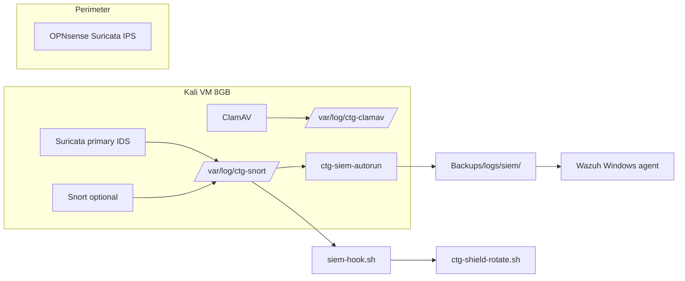

# Kali lab — SIEM stack (Snort vs Suricata vs Splunk vs Wazuh)

**Author:** Andy Kowal · **Organization:** [Hacker Planet LLC](https://salvador-Data.github.io/cyberThreatGotchi/) (Philadelphia, PA)  
**Authorized use:** Systems and networks you own or have written scope to test.

Companion: [KALI_IDS_IPS_CLAMAV.md](KALI_IDS_IPS_CLAMAV.md) · [CTG_SHIELD_SIEM_PLAYBOOK.md](CTG_SHIELD_SIEM_PLAYBOOK.md) · [WIRESHARK_IDS_SMS.md](WIRESHARK_IDS_SMS.md)

---

## Recommended SIEM for 8 GB Kali VM

**Use Wazuh (agent on Kali + Windows) with local JSON export — not Splunk Free on the VM.**

| Option | Verdict on 8 GB Kali | Why |
|--------|----------------------|-----|
| **Wazuh agent + manager on separate Linux VM** | **Recommended** | Agent ~200 MB RAM; manager on homelab host or Docker; ingests Suricata EVE, syslog, FIM |
| **CTG JSON export (`ctg-siem-autorun.sh`)** | **Default lightweight path** | No Elastic/Splunk stack on Kali; exports tails to `Backups/logs/siem/` for Windows tail |
| **Elastic Security (ELK)** | Skip on Kali VM | Elasticsearch alone wants 4+ GB; run on dedicated homelab box if needed |
| **Splunk Free (500 MB/day)** | **Document only — do not install on Kali VM** | Heavy JVM + indexing; use **Splunk Universal Forwarder on Windows** to ship `suricata-eve.json` from shared folder if you already run Splunk elsewhere |

**Professor answer:** Kali is the **sensor** (Suricata-primary IDS, optional Snort coexist, ClamAV). Correlation belongs on **Windows Wazuh agent** + optional **Wazuh manager VM**, or the CTG JSON aggregator until a manager is ready.

---

## Tool comparison

| Tool | Role on CTG lab | Mode | RAM (typical) | CTG script |
|------|-----------------|------|---------------|------------|
| **Suricata** | **Primary network IDS** on Kali | Detect-only default; `--EnableIPS` NFQUEUE on lab VLAN | ~300–800 MB | `ctg-ids-ips-autorun.sh` |
| **Snort** | Optional second opinion / rule diff | Passive detect-only; community rules | ~200–500 MB | Same (use `--skip-snort` on 8 GB VM) |
| **OPNsense Suricata** | **Production perimeter IPS** | Inline north-south at firewall | N/A (appliance) | Manual — not replaced by Kali |
| **ClamAV** | File AV on `/home` | Daemon + daily scan timer | ~100–300 MB | `ctg-clamav-scan.timer` |
| **Wazuh agent** | SIEM endpoint | Forward alerts + FIM | ~150–250 MB | `ctg-siem-autorun.sh --wazuh-agent` |
| **Splunk UF** | Optional forwarder | Ship EVE JSON to remote indexer | ~200 MB | Manual on Windows — see below |
| **Wireshark/tshark** | Host + Kali capture analysis | Non-root `wireshark` group on Kali | Varies | `Start-CTGWiresharkIDS.ps1 -OptimizeCapture` |

---

## IPS choice: Kali NFQUEUE vs OPNsense

| Path | When to use | Risk |
|------|-------------|------|
| **OPNsense Suricata (inline)** | Home/perimeter production | Policy at firewall — **preferred IPS** |
| **Kali Suricata + NFQUEUE** | Isolated lab VLAN only (`192.168.50.0/24`) | Can break gaming, VPN, iCloud — **opt-in** `--EnableIPS` |

Default autorun is **IDS only**. Inline IPS on Kali is for **authorized lab VLAN exercises**, not WAN replacement.

---

## One-liners (inside Kali VM)

Mount ctg share (`/mnt/ctg`), then:

```bash
sudo bash /mnt/ctg/ctg-ids-ips-autorun.sh --install --optimize --skip-snort
```

Full stack (WiFi + IDS + SIEM export):

```bash
sudo bash /mnt/ctg/ctg-lab-autorun.sh
```

SIEM export only:

```bash
sudo bash /mnt/ctg/ctg-siem-autorun.sh --install
```

Wazuh agent (set manager first):

```bash
export CTG_WAZUH_MANAGER=192.168.1.50
sudo bash /mnt/ctg/ctg-siem-autorun.sh --wazuh-agent --install
```

---

## What `--optimize` does

| Component | Optimization |
|-----------|--------------|
| **Suricata** | `detect-profile: low`, `workers` runmode, `set-cpu-affinity: yes`, af-packet ring/block tune, `suricata-update` daily timer |
| **Snort** (if not skipped) | Lightweight stream5 + sfportscan preprocessors only |
| **ClamAV** | OnAccess off, `MaxThreads 4`, TCP `127.0.0.1:3310` only |
| **Wireshark (Windows)** | `-OptimizeCapture`: 128 MB ring files, snaplen 1600, 96-file ring |

---

## Splunk (manual — license on indexer only)

Do **not** install Splunk Enterprise on the 8 GB Kali VM. If you run Splunk elsewhere:

1. Install **Splunk Universal Forwarder** on **Windows** (where `Backups/logs/siem/` lives).
2. Monitor `Backups\logs\siem\ctg-siem-latest.json` and shared `suricata-eve.json` from VBox folder.
3. Index sourcetype `suricata:json` for EVE lines.

See [Splunk Suricata TA](https://splunkbase.splunk.com/) on the indexer — not in this repo (license).

---

## Wireshark hardening (Kali)

Do not run Wireshark as root in daily lab use:

```bash
sudo usermod -aG wireshark "$USER"
# dumpcap capabilities (Debian/Kali package sets this on install)
getcap $(which dumpcap)
# expect: cap_net_admin,cap_net_raw+eip
```

Re-login after group change. See [KALI_WIFI_ETH_PROMISC.md](KALI_WIFI_ETH_PROMISC.md) for capture interfaces.

---

## Windows integration

| Path | Purpose |
|------|---------|
| `Backups\logs\siem\ctg-siem-latest.json` | Kali export tail — Suricata/Snort/ClamAV |
| `Backups\logs\wireshark-alerts.json` | Windows tshark IDS heuristics |
| `Start-CTGWiresharkIDS.ps1 -OptimizeCapture` | Tuned ring buffer capture |
| `CTG_WAZUH_MANAGER` env | Wazuh agent on Windows SOC |

Run SIEM hook + Shield after high-severity IDS lines:

```bash
sudo /opt/ctg/tor-http-scrambler/siem-hook.sh
sudo /opt/ctg/tor-http-scrambler/ctg-shield-rotate.sh status
```

---

## Systemd units (summary)

| Unit | Purpose |
|------|---------|
| `ctg-ids-ips.service` | Boot oneshot — ClamAV + Suricata-primary |
| `ctg-suricata.service` | Persistent Suricata IDS |
| `ctg-clamav-scan.timer` | Daily `/home` clamscan |
| `ctg-suricata-update.timer` | Daily `suricata-update` (with `--optimize`) |
| `ctg-siem-export.timer` | JSON export every 5 min |

---

## Architecture



---

*Defensive security engineering — Hacker Planet LLC · Authorized lab use only.*
