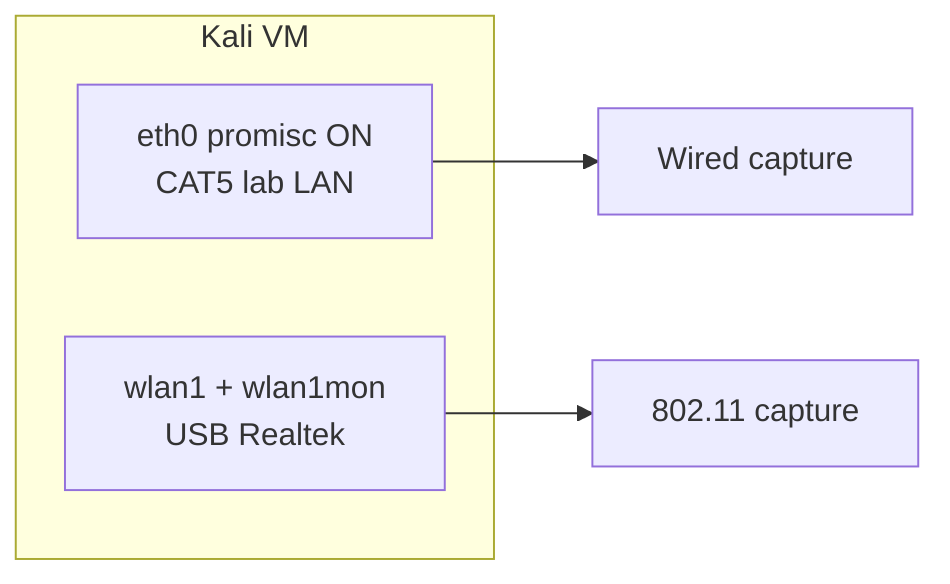

# Kali lab — Ethernet promiscuous vs WiFi monitor mode

**Author:** Andy Kowal · **Organization:** [Hacker Planet LLC](https://salvador-Data.github.io/cyberThreatGotchi/) (Philadelphia, PA)  
**Authorized use:** Networks and spectrum you own or have **written scope** to test. No third-party sniffing, illegal regdomain bypass, or jamming.

---

## Short answer (Andy’s question)

| Medium | Mode for full capture | What you get |
|--------|----------------------|--------------|
| **Ethernet (CAT5)** | **Classic promiscuous** (`ip link set dev eth0 promisc on`) when the cable is plugged and the link is **UP** | All Ethernet frames on that **LAN segment** (broadcast domain) — suitable for Wireshark on `eth0` |
| **WiFi (USB dongle)** | **`promisc` on wlan is often not enough** for 802.11 | Driver may ignore most over-the-air traffic; **monitor mode** (`airmon-ng start wlanX`) is required for meaningful **802.11** capture in Wireshark |
| **Both at once** | **Yes — different interfaces** | `eth0` promisc for wired lab sniff **and** `wlan1mon` (monitor) for wireless — not the same packet path, but both can be configured simultaneously |

---

## Ethernet (wired CAT5)

When a **cable is connected** to the VM’s wired NIC (`eth0`, `enp0s3`, etc.) and the link comes **UP**:

```bash
sudo ip link set dev eth0 promisc on
```

The NIC receives frames destined for other hosts on the same switched segment (within VLAN/broadcast domain limits). This is the traditional “promiscuous mode” taught for wired LAN analysis.

**CTG automation:** `ctg-wifi-lab-autorun.sh` detects a link-up wired interface and sets promisc automatically.

---

## WiFi (USB Realtek dongle)

### Promiscuous on `wlan` — usually insufficient

```bash
sudo ip link set wlan1 promisc on
```

On many WiFi drivers, **promiscuous** does **not** deliver full 802.11 management/data frames for off-SSID or non-associated traffic. You may only see traffic your station would normally process.

### Monitor mode — required for 802.11 capture

For **Wireshark 802.11** (beacons, probes, channel-wide lab capture on an **owned AP** segment):

```bash
sudo airmon-ng start wlan1
# Often creates wlan1mon — capture on that interface in Wireshark
```

Enable in CTG when lab capture is on:

```bash
sudo CTG_WIFI_MONITOR=1 bash /mnt/ctg/ctg-wifi-lab-autorun.sh --monitor
```

Or set `CTG_WIFI_MONITOR=1` in `/etc/ctg/lab-wifi.conf`.

---

## Running wired + wireless together



- **Wired:** classic promisc on `eth0` (or detected `enp*`) when cable present.
- **Wireless:** monitor via `airmon-ng` on USB `wlan` (not VirtualBox NAT `wlan0` if present).
- Frames on eth and wlan are **independent** — configure both; do not expect one interface to mirror the other.

---

## Lab WiFi config file

Copy the example on the host (staged to `C:\Users\Owner\Backups`) or in-repo:

```bash
sudo cp /mnt/ctg/lab-wifi.conf.example /etc/ctg/lab-wifi.conf
sudo chmod 600 /etc/ctg/lab-wifi.conf
sudo nano /etc/ctg/lab-wifi.conf
```

Set your **authorized lab SSID** and WPA2 PSK. Then:

```bash
sudo bash /mnt/ctg/ctg-wifi-lab-autorun.sh
```

**Log:** `/var/log/ctg-wifi-lab.log`  
**Boot service (optional):** `sudo bash /mnt/ctg/ctg-wifi-lab-autorun.sh --install` → `ctg-wifi-lab.service`

**Boot autopatch with WiFi:** `sudo bash /mnt/ctg/kali-boot-autopatch.sh --wifi-lab` (runs after Guest Additions fix).

---

## DuckDuckGo DNS

By default the WiFi autorun **preserves** existing DuckDuckGo DNS (`94.140.14.14` / `94.140.15.15`) — same policy as iPhone/Windows lab docs. Use `--ddg-dns-only` only when you intentionally want Kali resolv.conf forced to DDG.

---

## Legal and scope

Use only on **Hacker Planet lab VLAN**, **owned AP**, or networks where you have **explicit authorization**. Document scope in `lab-targets.conf`. No rogue AP attacks, deauth, or regdomain hacks in this repo.

---

## Related docs

- [CTG_LAB_AUTORUN.md](CTG_LAB_AUTORUN.md) — `Start-CTGLab.ps1` + `ctg-lab-autorun.sh`
- [KALI_LAB_ARCHITECTURE.md](KALI_LAB_ARCHITECTURE.md) — Realtek passthrough, Option 2 `company-lab`
- [scripts/kali/README_KALI_LAB.md](../scripts/kali/README_KALI_LAB.md)
