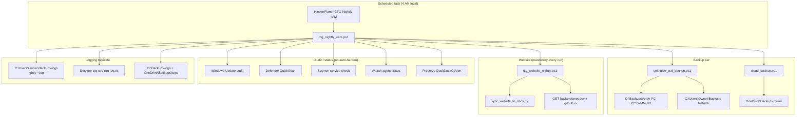

# Portfolio — Nightly Automation & Windows SOC Operations

**Author:** Andy Kowal · **Organization:** [Hacker Planet LLC](https://salvador-Data.github.io/cyberThreatGotchi/) (Philadelphia, PA)  
**GitHub:** [salvador-Data](https://github.com/salvador-Data) · **Flagship repo:** [CyberThreatGotchi](https://github.com/salvador-Data/cyberThreatGotchi)

**Companions:** [PORTFOLIO_SYSTEM_HARDENING.md](PORTFOLIO_SYSTEM_HARDENING.md) — layered defensive stack (Sysmon, Wazuh, HWS, backups, VPN preserve) · [PORTFOLIO_FIRMWARE_OS.md](PORTFOLIO_FIRMWARE_OS.md) — M5 OS Cardputer firmware/OS (manual dev; **not** part of nightly task).

---

## Overview

This portfolio piece documents **unattended Windows laptop automation** built for a founder workstation: a daily **4:00 AM** scheduled task that orchestrates resilient backup, **hackerplanet.dev** website hygiene, security posture checks, and auditable logging—without running disruptive full hardening every night.

The design separates **gentle nightly maintenance** from **elevated SOC passes** (`ctg_soc_run_once.ps1`). Nightly work is idempotent, flag-gated, and honest about hardware reality (external SDK SSD often **No Media**, UAC, low **C:** disk). Nothing in scripts commits secrets; webhook and Wazuh manager values live in environment variables only.

**Scope boundary:** **Windows laptop + hackerplanet.dev only.** M5Stack Cardputer PlatformIO uploads and microSD app installs remain **manual**—never scheduled by `HackerPlanet-CTG-Nightly-4AM`.

**Authorized use only:** systems you own or are explicitly permitted to administer (personal lab, CTG development host, future MSP kit narratives). Not for unauthorized monitoring or evasion.

---

## Architecture



**ASCII (operations view):**

```
04:00 Task Scheduler (Highest, WakeToRun)
        ↓
ctg_nightly_4am.ps1
        ↓
  Disk space C: / D:  →  SSD probe (Disk 1, D:\ writable)
        ↓
  selective_ssd_backup  +  cloud_backup  (unless -SkipBackup)
        ↓
  ctg_website_nightly  (ALWAYS: website/, docs/web/, portfolio, health GET)
        ↓
  WU audit | Defender QuickScan | Sysmon | Wazuh | VPN preserve | Git dry-run
        ↓
  SOC logs → D:\Backups\logs\ (when SSD online) + OneDrive mirror
```

---

## Scheduled task: HackerPlanet-CTG-Nightly-4AM

Registered by `Register-CtgNightlyTask.ps1` (via one-shot `ctg_nightly_install.ps1` in Admin PowerShell).

| Property | Value |
|----------|-------|
| **Name** | `HackerPlanet-CTG-Nightly-4AM` |
| **Trigger** | Daily **4:00 AM** local time |
| **Action** | `powershell.exe -NoProfile -ExecutionPolicy Bypass -File ctg_nightly_4am.ps1` |
| **Principal** | Interactive user, **RunLevel Highest** |
| **Settings** | WakeToRun, StartWhenAvailable, 4-hour execution limit, runs on battery |

**Why 4 AM:** Laptop is typically idle; backup and website sync complete before the workday. WakeToRun attempts AC wake when hardware supports it.

**Why not harden nightly:** `Harden-Windows-Security` full apply and Sysmon install can break VPN, dev tooling, or require reboot. Those remain **manual or quarterly** via `ctg_soc_run_once.ps1` / `harden_windows.ps1` with explicit flags.

---

## Orchestrator: ctg_nightly_4am.ps1

Central orchestrator in `scripts/windows/ctg_nightly_4am.ps1`. Uses `CTG-AdminCommon.ps1` for admin detection; continues on step errors (aggregates `$StepErrors`) rather than failing the entire run when one subsystem is unavailable.

### Orchestration order

1. **Header** — timestamp, hostname, user, admin flag, scope (laptop + hackerplanet.dev)
2. **Disk space** — **C:** and **D:** (if present); **WARN** if free &lt; 5 GB
3. **SSD status** — `Get-CtgSsdStatus`: Disk 1 operational state, **No Media** detection, `mount_ssd_d.ps1` if offline (Admin), write probe under `D:\Backups`
4. **Backup root resolution** — `D:\Backups\Andy-PC-YYYY-MM-DD` when SSD online/writable; else `C:\Users\Owner\Backups\Andy-PC-YYYY-MM-DD`
5. **selective_ssd_backup.ps1** — user data + Projects (skipped with `-SkipBackup`)
6. **cloud_backup.ps1** — manifest and log mirror to OneDrive (skipped with `-SkipBackup`)
7. **ctg_website_nightly.ps1** — **always runs** (see below)
8. **Windows Update audit** — list pending updates; install only with `-ApplyUpdates`
9. **Defender QuickScan** — async `Start-MpScan -ScanType QuickScan`
10. **Sysmon service** — status and start type (no install nightly)
11. **Wazuh agent** — service status if `CTG_WAZUH_MANAGER` / `WAZUH_MANAGER` set
12. **Preserve-DuckDuckGoVpn.ps1** — Defender exclusions for DDG WireGuard; no competing VPN installers
13. **Git repos** — dry-run `git fetch` + `status` unless `-SyncRepos` (`git pull --ff-only`)
14. **SOC log copy** — nightly + desktop logs to `D:\Backups\logs\` when SSD online
15. **Summary line** — SSD status, backup root, error count, flag states

---

## Website nightly: ctg_website_nightly.ps1

Mandatory child script; invoked on **every** orchestrator run regardless of `-SkipBackup`.

| Step | Action |
|------|--------|
| **Robocopy backup** | `website/` → `{BackupRoot}\website\` |
| | `docs/web/` → `{BackupRoot}\docs-web\` |
| **Portfolio backup** | Copy `docs/PORTFOLIO_*.md` → `{BackupRoot}\portfolio\` |
| **Portfolio HTML** | `python scripts/export_portfolio_html.py` → `{BackupRoot}\portfolio_export\` |
| **Canonical sync** | `python scripts/sync_website_to_docs.py` (`website/` → `docs/web/`) |
| **Git review** | `git status --porcelain website/ docs/web/` |
| **Optional deploy** | With `-DeployWebsite`: commit + push to `main` → GitHub Actions `pages.yml` → `gh-pages` |
| **Health checks** | GET `https://hackerplanet.dev/` and GitHub Pages mirror |

Default nightly behavior: **backup + sync + health only**—no automatic commit/push. Deploy is opt-in to avoid surprise production publishes.

---

## Backup matrix

| Content | Source | SSD online (`D:\Backups\Andy-PC-YYYY-MM-DD\`) | C: fallback | OneDrive mirror |
|---------|--------|-----------------------------------------------|-------------|-----------------|
| Documents / Desktop / Pictures | User folders | Via selective backup | Same | Manifest + subset via `cloud_backup.ps1` |
| **Projects** | `C:\Users\Owner\Projects` | `Projects\` (robocopy, caps/exclusions) | Same | Manifest references |
| **Website** | `website/` | `website\` | Same | `website\` |
| **Docs web mirror** | `docs/web/` | `docs-web\` | Same | `docs-web\` |
| **Portfolio md** | `docs/PORTFOLIO_*.md` | `portfolio\` | Same | `portfolio\` |
| **Portfolio HTML** | `export_portfolio_html.py` | `portfolio_export\` | Same | `portfolio_export\` |
| Registry sample / programs list | selective backup | Root of day folder | Same | Copied by cloud_backup |
| **Nightly log** | `Backups\logs\nightly-*.log` | `D:\Backups\logs\` | Primary on C: | `OneDrive\Backups\logs\` |
| **SOC log** | Desktop `ctg-soc-run-log.txt` | `D:\Backups\logs\` | Desktop | Nightly log mirrored |
| **Elevated SOC log** | `ctg-soc-run-log-elevated.txt` | `D:\Backups\logs\` | scripts/windows | When present |

**Resolver chain** (when SSD unavailable): `D:\Backups\` → other fixed letters with space → `OneDrive\Backups\` → `%USERPROFILE%\Backups\`.

---

## Logging strategy

Every step writes to a **dated nightly log** and **appends** to the desktop SOC history file—operators can review recent automation without opening Task Scheduler.

| Path | Purpose |
|------|---------|
| `C:\Users\Owner\Backups\logs\nightly-YYYY-MM-DD.log` | Primary nightly log (authoritative) |
| `%USERPROFILE%\Desktop\ctg-soc-run-log.txt` | Rolling append mirror (SOC history) |
| `D:\Backups\logs\nightly-YYYY-MM-DD.log` | SSD copy when Disk 1 online |
| `D:\Backups\logs\ctg-soc-run-log.txt` | SSD SOC mirror |
| `D:\Backups\logs\ctg-soc-run-log-elevated.txt` | Elevated pass mirror (from `ctg_soc_run_once.ps1`) |
| `%OneDrive%\Backups\logs\nightly-YYYY-MM-DD.log` | Cloud mirror via `cloud_backup.ps1` |

Desktop write uses a **3-attempt retry** (250 ms backoff) to survive OneDrive file locks—a lesson from elevated SOC logging.

Example summary line (end of run):

```
SUMMARY: Host=ANDY-PC SSD=online BackupRoot=D:\Backups\Andy-PC-2026-05-30 Errors=0 ApplyUpdates=False SkipBackup=False DeployWebsite=False
```

---

## Security scans and posture checks (nightly)

These are **audit/status** steps—not full hardening installs.

| Check | Nightly behavior | Notes |
|-------|------------------|-------|
| **Windows Update** | Audit list pending; `-ApplyUpdates` to install (AutoReboot off in PSWindowsUpdate path) | Default: no surprise reboot |
| **Defender** | QuickScan started as async job | Full scan remains manual |
| **Sysmon** | Service status logged | Install/update via `ctg_soc_run_once.ps1` / `install_sysmon.ps1` |
| **Wazuh** | Agent service + manager env logged | Skipped if manager env unset |
| **Disk space** | Warn &lt; 5 GB on C: / D: | Dev trees compete with restore points |
| **VPN preserve** | DDG WireGuard exclusions refreshed | No stacked DNS VPN installers |

---

## Manual vs automatic flags

| Flag | Default | Effect |
|------|---------|--------|
| `-ApplyUpdates` | off | Install Windows Updates (may reboot) |
| `-SkipBackup` | off | Skip selective + cloud backup only; **website nightly still runs** |
| `-DeployWebsite` | off | Commit/push `website/` + `docs/web/` to `main` (triggers Pages) |
| `-SyncRepos` | off | `git pull --ff-only` instead of dry-run fetch/status |
| `-VerboseLog` | off | Echo each log line to console |

**Typical scheduled run:** all flags off—backup, website sync/health, audit scans, log mirror.

**Manual elevated path:** `ctg_soc_run_once.ps1` (restore point → backup → Sysmon → HWS audit → ASR audit → Wazuh) — documented in [PORTFOLIO_SYSTEM_HARDENING.md](PORTFOLIO_SYSTEM_HARDENING.md). Nightly task does **not** replace this.

---

## Elevated SOC vs nightly automation

| Aspect | Nightly (`ctg_nightly_4am.ps1`) | Elevated (`ctg_soc_run_once.ps1`) |
|--------|--------------------------------|-----------------------------------|
| **Schedule** | Daily 4 AM task | Manual / quarterly |
| **Admin** | Preferred (SSD mount); degrades gracefully | Required for Sysmon, restore point, mount |
| **Harden-Windows-Security** | Not run | Audit-only pass |
| **Sysmon install** | Status check only | Install/update |
| **Backup** | Yes (unless `-SkipBackup`) | Yes |
| **Website** | Always | No |
| **Log file** | `nightly-*.log` + desktop SOC | `ctg-soc-run-log-elevated.txt` |

---

## Challenges solved (honest)

| Challenge | Manifestation | Mitigation in automation |
|-----------|---------------|--------------------------|
| **SSD No Media** | Disk 1 shows `OperationalStatus=No Media`; D: absent | Log `SSD: not_ready`; fallback to C: + OneDrive; **no fatal exit** |
| **SSD offline** | Disk present but not mounted | `mount_ssd_d.ps1` when Admin; else C: fallback |
| **UAC / non-admin nightly** | Mount skipped; some steps degraded | Task registered **RunLevel Highest**; orchestrator logs `Admin=True/False` |
| **Sysmon exit 740** | Elevated install fails from standard shell | Documented in `install_sysmon.ps1`; use `Run-AsAdmin.ps1` / elevated SOC pass |
| **C: low disk** | PlatformIO, venvs, Wazuh logs | 5 GB warn threshold; selective backup (not full clone); Pictures cap |
| **OneDrive file lock** | Desktop log append fails | Retry loop in nightly + elevated log writers |
| **Surprise deploy** | Auto-push could publish broken site | `-DeployWebsite` off by default; health GET every night |
| **VPN breakage** | Aggressive hardening or ASR | Nightly skips HWS; `Preserve-DuckDuckGoVpn.ps1` each run |

---

## DevSecOps alignment

| Principle | Implementation |
|-----------|----------------|
| **No secrets in git** | `CTG_WEBHOOK_URL`, `CTG_WEBHOOK_SECRET`, Wazuh manager via env only |
| **Authorized defensive use** | Backup and telemetry on owned/permitted systems |
| **Audit before enforce** | Nightly = observe; hardening = explicit elevated run |
| **Idempotent scripts** | Robocopy mirrors, service status checks, skip missing optional modules |
| **Test surface** | Python CI (pytest, bandit); PowerShell runbooks in `README_WINDOWS_SOC.md` |

Platform policy: [SECURITY_HARDENING.md](SECURITY_HARDENING.md) · Windows runbook: [scripts/windows/README_WINDOWS_SOC.md](../scripts/windows/README_WINDOWS_SOC.md)

---

## MSP / kits narrative (Hacker Planet LLC)

For **Year 1** (~$84K target: kits, Pro feed, MSP retainers), this automation demonstrates:

1. **Reproducible operator runbooks** — install task once, review logs daily from desktop mirror
2. **Tiered backup** — SSD when present, cloud manifest always, no full-disk imaging tax
3. **Website + portfolio DR** — nightly robocopy of public site and portfolio artifacts
4. **Honest hardware docs** — No Media SSD, UAC, 740 errors documented for customer onboarding
5. **Separation of concerns** — gentle nightly vs quarterly hardening = fewer break-fix calls

MSP deliverable shape: register task + env template + log review checklist—not opaque RMM black boxes.

---

## Install and verify

Admin PowerShell (one command per block):

```powershell
cd C:\Users\Owner\Projects\cyberThreatGotchi
```

```powershell
powershell -NoProfile -ExecutionPolicy Bypass -File .\scripts\windows\ctg_nightly_install.ps1
```

Verify:

```powershell
Get-ScheduledTask -TaskName 'HackerPlanet-CTG-Nightly-4AM' | Format-List
```

Manual test (no wait until 4 AM):

```powershell
powershell -NoProfile -ExecutionPolicy Bypass -File .\scripts\windows\ctg_nightly_4am.ps1 -VerboseLog
```

---

## Script inventory

| Script | Role |
|--------|------|
| `ctg_nightly_4am.ps1` | Nightly orchestrator |
| `ctg_website_nightly.ps1` | Website backup, sync, portfolio export, health GET |
| `Register-CtgNightlyTask.ps1` | Creates `HackerPlanet-CTG-Nightly-4AM` |
| `ctg_nightly_install.ps1` | One-shot Admin installer |
| `selective_ssd_backup.ps1` | Selective user-data + Projects backup |
| `cloud_backup.ps1` | OneDrive staging + optional webhook ping |
| `mount_ssd_d.ps1` | Online Disk 1, assign **D:** without format |
| `Preserve-DuckDuckGoVpn.ps1` | DDG VPN Defender exclusions |
| `ctg_soc_run_once.ps1` | Elevated SOC pass (not nightly) |
| `CTG-AdminCommon.ps1` | Shared admin detection |

---

## Links

| Resource | URL |
|----------|-----|
| CyberThreatGotchi | https://github.com/salvador-Data/cyberThreatGotchi |
| Windows SOC scripts | https://github.com/salvador-Data/cyberThreatGotchi/tree/main/scripts/windows |
| hackerplanet.dev | https://hackerplanet.dev/ |
| System hardening portfolio | [PORTFOLIO_SYSTEM_HARDENING.md](PORTFOLIO_SYSTEM_HARDENING.md) |
| Firmware/OS portfolio | [PORTFOLIO_FIRMWARE_OS.md](PORTFOLIO_FIRMWARE_OS.md) |
| LinkedIn blurb | [PORTFOLIO_AUTOMATION_SOC_SUMMARY.md](PORTFOLIO_AUTOMATION_SOC_SUMMARY.md) |

---

*Nightly automation & SOC operations — Hacker Planet LLC · Philadelphia, PA*
