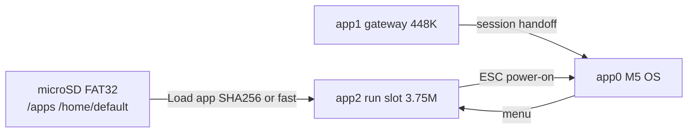

# Portfolio — Firmware & Pocket OS (M5 OS Cardputer)

**Author:** Andy Klwal · **Organization:** [Hacker Planet LLC](https://salvador-Data.github.io/cyberThreatGotchi/) (Philadelphia, PA)  
**GitHub:** [salvador-Data](https://github.com/salvador-Data) · **Firmware repo:** [M5_OS-Cardputer](https://github.com/salvador-Data/M5_OS-Cardputer)

**Companion:** [PORTFOLIO_SYSTEM_HARDENING.md](PORTFOLIO_SYSTEM_HARDENING.md) — Windows SOC, iPhone hardening, backups, Wazuh/Sysmon stack.

---

## Overview

**M5 OS — Cardputer Edition** is a custom ESP32-S3 operating shell for the M5Stack Cardputer: keyboard-first launcher, SD-first virtual filesystem, dual/ triple-partition OTA with a dedicated run slot, M5Burner catalog integration, session/gateway boot policy, embedded **UTMS** security menu, and a **183-test** pytest contract suite with GitHub Actions CI. Built as the pocket layer of the Hacker Planet / CyberThreatGotchi ecosystem.

**CyberThreatGotchi** (this repo) supplies platform DevSecOps, Windows SOC scripts, iPhone runbooks, and edge IPS narrative—see system hardening portfolio for desktop/mobile ops.

---

## Architecture

### Flash layout (8 MB)

From `partitions/m5os_cardputer_8MB.csv`:

| Partition | Subtype | Size | Role |
|-----------|---------|------|------|
| **app0** | `ota_0` | 3.75 MiB | M5 OS launcher (home partition) |
| **app1** | `ota_1` | 448 KiB | Session **gateway** (minimal handoff image) |
| **app2** | `ota_2` | 3.75 MiB | **Run slot** for Load app / M5Burner OTA |
| **otadata** | OTA metadata | 8 KiB | Boot selection; explicit read-modify-write for safety |

### SD-first VFS

Paths under FAT32 (contacts away from screen): `/apps/` (multi-app `.bin` coexistence), `/home/default/` (settings, UTMS), `/system/`, `/tmp`, `/var/log`. Manifest at `/apps/manifest.json`. Legacy `/firmware/` paths still accepted for migration.

### Load app pipeline

1. Whitelist pick from `/apps/<name>/`
2. Optional SHA256 verify (Enter) or fast load (Tab) with ESP magic `0xE9` check
3. `esp_ota_begin` / `write` / `end` into **app2** (not gateway-sized app1)
4. Chip validation: ESP32-S3 only; **merged-bin rejection** (Bruce/M5Launcher composites must not OTA-reboot into wrong layout)
5. **otadata** updates with sector-safe writes; session launch marks `ESP_OTA_IMG_VALID` to avoid spurious rollback
6. **Snapback diagnostics** on failure; ESC/` at cold boot restores M5 OS on app0

### M5Burner catalog

HTTP **Range** downloads, HWID-aware catalog entries, app slice extraction to SD and OTA stream into app2. Host tooling: `m5burner_hookup.py`, `import_m5burner_entry.py` with `MAX_OTA_APP1_BYTES = 0x3C0000` guard.

### Session / boot policy

Custom bootloader component: power-on behavior evolved toward **home**, `launch_pend`, cold-boot restore. Gateway embed (`prebuild_gateway_embed.py`) flashes minimal app1 for staged handoff; `gateway_embed` CI ensures reproducible builds.

### UTMS (embedded security)

Menu: micro-AV scan over `/apps/*.bin`, threat-pack OTA, quarantine under `/home/default/utms/quarantine`, firewall rules stub, IDS status, rotated logs. Ties to desktop SOC story in [PORTFOLIO_SYSTEM_HARDENING.md](PORTFOLIO_SYSTEM_HARDENING.md).

### UX / hardware

Guy Fawkes boot intro, six theme presets, Stamp-S3 **SK6812** glow (GPIO 21), battery-aware power savings, JSON serial logging at 115200 baud.

---

## Security

- Authorized-use framing; no offensive network tooling
- Hash-fast path uses mbedtls hardware SHA; load cache skips unchanged files (size + mtime)
- Threat-pack URL overridable in settings; host `validate_manifest.py` / `utms_threat_pack.py` mirror firmware parsers
- Constant-time comparisons and path sanitization patterns shared with CTG Python `core.security` philosophy

---

## Challenges solved

| Issue | Approach |
|-------|----------|
| Composite SPIFFS apps (Bruce) | Reject merged images for OTA; SD slice install only |
| 4 MiB app cap | `kMaxAppBinBytes = 0x3C0000` enforced in firmware + pytest |
| Foreign firmware trap | ESC/` hold at power-on → restore app0 |
| Gateway vs run slot confusion | app2 preferred; tests lock `ESP_PARTITION_SUBTYPE_APP_OTA_2` |
| CI gateway embed drift | `prebuild_gateway_embed.py` + workflow build fix |

---

## Honest limits

- **SPIFFS composite apps** from ecosystem tools exceed run slot or mix FS+app—manual SD workflow only
- **~3.75 MiB** maximum per loaded app binary
- **ESC recovery** required when third-party firmware owns boot path
- Pocket UTMS is **integrity-focused**, not a Wazuh replacement

---

## Stack

| Layer | Technology |
|-------|------------|
| MCU | ESP32-S3 (M5Stack Cardputer) |
| Build | PlatformIO, Arduino framework |
| Storage | microSD SPI (FAT32) |
| OTA | ESP-IDF OTA API, custom partition CSV |
| CI | GitHub Actions, ~**183** pytest contract tests |
| Host | Python 3 scripts for manifest, M5Burner, threat packs |

---

## CyberThreatGotchi platform (brief tie-in)

| Area | Link |
|------|------|
| DevSecOps rules | `.cursor/rules`, `SECURITY_HARDENING.md` |
| Windows SOC | `scripts/windows/` |
| Payments | Stripe/PayPal hosted checkout; env-only secrets |
| Ecosystem | `docs/ECOSYSTEM.md` |

---

## Links

| Resource | URL |
|----------|-----|
| M5_OS-Cardputer | https://github.com/salvador-Data/M5_OS-Cardputer |
| CyberThreatGotchi | https://github.com/salvador-Data/cyberThreatGotchi |
| Product page | https://salvador-Data.github.io/cyberThreatGotchi/cardputer.html |
| System hardening portfolio | [PORTFOLIO_SYSTEM_HARDENING.md](PORTFOLIO_SYSTEM_HARDENING.md) |

---

*Firmware/OS engineering — Hacker Planet LLC · Philadelphia, PA*
