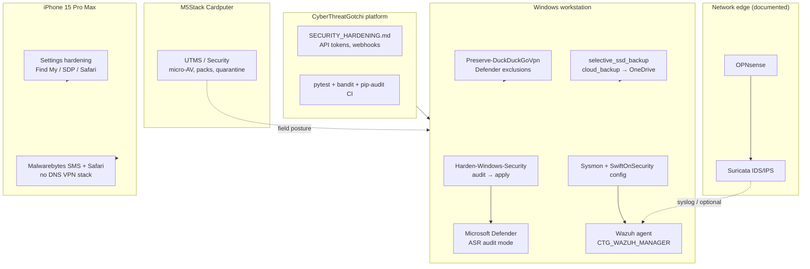

# Portfolio — Defensive System Hardening Stack

**Author:** Andy Kowal · **Organization:** [Hacker Planet LLC](https://salvador-Data.github.io/cyberThreatGotchi/) (Philadelphia, PA)  
**GitHub:** [salvador-Data](https://github.com/salvador-Data) · **Flagship repo:** [CyberThreatGotchi](https://github.com/salvador-Data/cyberThreatGotchi)

**Companions:** [PORTFOLIO_FIRMWARE_OS.md](PORTFOLIO_FIRMWARE_OS.md) — M5 OS Cardputer firmware/OS arc (pocket UTMS, OTA launcher) · [PORTFOLIO_AUTOMATION_SOC.md](PORTFOLIO_AUTOMATION_SOC.md) — nightly 4 AM backup, website, and SOC logging automation.

---

## Overview

This portfolio piece documents a **layered defensive stack** built for a founder workstation and homelab: Windows host hardening with auditable automation, host telemetry and SIEM agent plumbing, resilient backup without full-disk imaging, iPhone hardening under real iOS constraints, and pocket **UTMS** on Cardputer that mirrors the same “defense in depth, authorized use only” mindset as the desktop SOC.

The design optimizes for **free/open components** (Sysmon, Wazuh, Harden-Windows-Security, OPNsense/Suricata at the edge) while keeping commercial EDR optional. Nothing in the repo ships secrets; elevation, VPN preservation, and honest hardware limits (C: space, SSD **No Media**, UAC) are first-class operational concerns—not afterthoughts.

**Authorized use only:** systems you own or are explicitly permitted to administer (personal lab, CTG development host, future MSP kit narratives). Not for unauthorized monitoring or evasion.

---

## Threat model

| Asset | Context | Primary risks |
|-------|---------|---------------|
| **Windows 11 workstation** | Daily driver + CTG/M5 OS development | Credential theft, ransomware, misconfigured hardening breaking VPN/productivity |
| **External SDK SSD (intended D:)** | PlatformIO, large backups | Offline disk, ghost drive letters, backup target unavailable |
| **iPhone 15 Pro Max** | Personal comms / 2FA | Phishing, device theft, **accidental VPN/DNS override** from “security” apps |
| **Homelab perimeter** | Documented, not fully scripted | North-south intrusion, lateral movement from guest VLANs |
| **Cardputer (M5 OS)** | Field kit | Malicious `.bin` on SD, supply-chain manifests |

**Assumptions:** single operator (Andy), willingness to run **audit-before-enforce** on CIS-style baselines, and retention of **DuckDuckGo VPN (WireGuard)** as the sole system VPN on Windows—no stacking Cloudflare/NextDNS VPN profiles via CTG scripts.

---

## Layered architecture



**ASCII (operations view):**

```
[Internet] → OPNsense/Suricata (homelab doc)
                    ↓
         Windows: Defender + ASR(audit) + Sysmon → Wazuh manager
                    ↓
         Scripts: restore point → SSD backup → Sysmon → HWS audit → ASR audit
                    ↓
         Logs: Desktop + D:\Backups\ctg-soc-run-log.txt (when D: online)
```

---

## Windows SOC (primary focus)

### Orchestration model

`scripts/windows/harden_windows.ps1` is **guidance-by-default**: no policy changes until explicit switches (`-InstallSysmon`, `-RunHardenWindowsSecurity`, `-SetupWazuhAgent`, `-DefenderASRAudit`, `-CloudBackup`). This avoids “run script, break laptop” failures on a founder machine.

`ctg_soc_run_once.ps1` encodes Andy’s **elevated one-shot**: restore point → `selective_ssd_backup.ps1` → optional `cloud_backup.ps1` → Sysmon → Harden-Windows-Security **audit only** → Defender ASR audit → Wazuh (only if `CTG_WAZUH_MANAGER` / `WAZUH_MANAGER` set). It logs to `ctg-soc-run-log-elevated.txt`, mirrors to Desktop (with retry for OneDrive file locks), and copies to `D:\Backups\` when `D:` exists.

**Admin elevation:** Sysmon install, disk online/mount, restore points, and full HWS apply require Administrator. `CTG-AdminCommon.ps1` centralizes `Test-CtgIsAdmin`; `Elevate-CTG-SOC.bat` / `Run-AsAdmin.ps1` trigger UAC for operators who start from a non-elevated shell. **Exit code 740** from Sysmon is explicitly mapped to “re-run elevated”—a common failure mode when UAC was declined or Terminal wasn’t “Run as administrator.”

### Script inventory

| Script | Role |
|--------|------|
| `harden_windows.ps1` | Flag-gated orchestrator; restore point prompt unless `-SkipRestorePoint` |
| `install_sysmon.ps1` | Sysinternals download + SwiftOnSecurity `sysmonconfig-export.xml` → `%ProgramData%\CTG\Sysmon` |
| `ctg_soc_run_once.ps1` | Elevated SOC pass + triplicate logging |
| `selective_ssd_backup.ps1` | Robocopy-style selective backup (Documents, Desktop, Projects, capped Pictures); manifest + program list |
| `cloud_backup.ps1` | Stage manifest/logs to `OneDrive\Backups\Andy-PC-YYYY-MM-DD`; optional webhook ping (env secrets only) |
| `mount_ssd_d.ps1` | Online Disk 1, clear readonly, assign **D:** without format; handles ghost `D:` |
| `Preserve-DuckDuckGoVpn.ps1` | Defender path exclusions for DDG WireGuard; **no** second VPN installer |
| `wazuh_agent_setup.ps1` | Agent MSI/winget path; manager from env |
| `ADMIN_STEPS.md` | Human runbook: UAC, mount order, VPN preserve matrix |

### Harden-Windows-Security integration

The stack treats [Harden-Windows-Security](https://github.com/Harden-Windows-Security/Module) as a **CIS-aligned policy engine**, not a black box. Production path on the daily driver: `-HardenWindowsSecurityAuditOnly` first (via `ctg_soc_run_once.ps1`), review deltas, then optional enforce on a VM gold image. Full apply without audit can conflict with VPN, RDP, or dev tooling—documented in `ADMIN_STEPS.md`.

### Sysmon + SwiftOnSecurity

Sysmon provides **process creation, network connection, and file create** telemetry with a community-tuned ruleset. Install is idempotent (`-Force` reinstall); config updates use `Sysmon64.exe -c`. Tradeoff: volume and noise on a dev box—correlation belongs in Wazuh rules, not raw Event Viewer scrolling.

### Wazuh agent path

Agent install is **conditional on environment**: `CTG_WAZUH_MANAGER` (preferred) or `WAZUH_MANAGER`. No manager IP is committed to git. Agent speaks **1514/TCP** to a Linux manager (Docker/VM/cloud trial). Scripts install **agent only**; manager dashboards, FIM, and rule tuning are homelab/MSP scope.

### Backup strategy (tradeoffs)

1. **Selective local/SSD** — Not a full C: clone. Skips OneDrive-redundant paths under synced folders to save space. Pictures capped (default 50 GB). Falls back: `D:\Backups\` → other fixed letters → `OneDrive\Backups\` → `%USERPROFILE%\Backups\`.
2. **Cloud** — `cloud_backup.ps1` copies manifests and critical artifacts into OneDrive for off-site resilience without uploading secrets.
3. **SSD D:** — Intended SDK volume (label **SSD**). Hardware reality: disk often **offline / No Media** until `mount_ssd_d.ps1` (admin). SOC log copy to `D:\Backups\` is best-effort.

**C: disk pressure:** Development trees (PlatformIO, Python venvs, Wazuh logs) compete with restore points and Sysmon archives. The selective backup design is intentional: **recover work**, not mirror every byte.

### VPN preservation (Windows)

Andy’s workstation uses **DuckDuckGo VPN**. CTG scripts **do not** install competing DNS VPN apps. `Preserve-DuckDuckGoVpn.ps1` adds Defender exclusions for DDG binaries and logs tunnel state—reducing false positives without disabling Defender. iPhone docs use the same philosophy for existing VPN/DNS (see below).

### Free/open vs commercial EDR

| Capability | This stack | Typical commercial EDR |
|------------|------------|-------------------------|
| Host telemetry | Sysmon + Defender | Kernel sensor + cloud analytics |
| Correlation | Wazuh (self-hosted) | Vendor SaaS |
| Network IPS | OPNsense/Suricata (documented) | Often separate license |
| Cost | OSS + Windows built-ins | Per-seat subscription |
| Operator skill | Andy runs scripts; MSP doc for kits | Vendor SOC optional |

For Hacker Planet **Year 1 kits**, the narrative is: reproducible scripts + runbooks, not mandated CrowdStrike-tier spend.

---

## Challenges solved (honest)

| Challenge | Manifestation | Mitigation |
|-----------|---------------|------------|
| **UAC / non-admin shell** | Sysmon exit **740**, mount fails | `Run-AsAdmin.ps1`, `ADMIN_STEPS.md`, explicit 740 message in `install_sysmon.ps1` |
| **SSD No Media / offline** | `D:` missing; backup falls back | `mount_ssd_d.ps1`; `selective_ssd_backup` resolver chain; SOC log still on Desktop |
| **Ghost D: letter** | Size 0 volume blocks assign | `mount_ssd_d.ps1` removes stale access path before reassignment |
| **OneDrive file lock** | Desktop log write fails | Retry loop in `ctg_soc_run_once.ps1` |
| **Hardening vs VPN** | Second VPN or aggressive ASR | Audit-only HWS in one-shot; DDG preserve script; no CTG DNS VPN installers |
| **C: space** | Restore point + build artifacts | Selective backup; skip huge Pictures; cloud manifest-only tier |

---

## iPhone 15 Pro Max defensive hardening

**Docs:** [IPHONE_HARDENING.md](IPHONE_HARDENING.md) · [IPHONE_RUN_NOW.md](IPHONE_RUN_NOW.md) · [IPHONE_USB_HARDENING.md](IPHONE_USB_HARDENING.md)

**iOS constraint:** No traditional filesystem AV. App Store “antivirus” cannot scan other apps’ sandboxes like Defender on Windows. The portfolio approach is **Settings-first** (Face ID, Stolen Device Protection, Find My, Safari fraud warning, USB restricted when locked, AirDrop contacts-only), then **additive tools that do not steal the VPN slot**.

**Preserve VPN/DNS:** Step 0 documents existing VPN profiles and Wi‑Fi Manual DNS before any app install. Malwarebytes free tier = **SMS filtering + Safari content blocking**—compatible with DuckDuckGo/NextDNS/Private Relay because it does not install a competing system DNS VPN. Optional Cloudflare/NextDNS apps are documented as **mutually exclusive** with other DNS VPN strategies.

**Phase model:** **Phase 1** = Settings baseline (preserves DuckDuckGo VPN/DNS). **Phase 2** = Malwarebytes free, USB hardening, optional Lockdown Mode, verify VPN unchanged. Consolidated runbook: [IPHONE_RUN_NOW.md](IPHONE_RUN_NOW.md).

**USB to Windows SOC:** USB Restricted Mode, trust-only-laptop, encrypted backup via Apple Devices to SSD/OneDrive backup trees, optional `scripts/windows/iphone_usb_check.ps1` log reminder—no MDM push from PC. Phase 2 § 2.3 in `IPHONE_RUN_NOW.md`.

---

## Cardputer UTMS (embedded tie-in)

On [M5_OS-Cardputer](https://github.com/salvador-Data/M5_OS-Cardputer), **UTMS / Security** provides pocket-scale parity with desktop themes: micro-AV scan over `/apps/*.bin`, OTA **threat packs** to `/home/default/utms/threat_pack.json`, quarantine moves, firewall stub, IDS status display, rotated UTMS logs. Host-side `scripts/utms_threat_pack.py` mirrors firmware parse rules for CI.

This is not a replacement for Wazuh on Windows—it is **field integrity** for SD-stored firmware and manifests, aligned with the same authorized-use framing. See [PORTFOLIO_FIRMWARE_OS.md](PORTFOLIO_FIRMWARE_OS.md) for partition/OTA architecture.

---

## CyberThreatGotchi platform (DevSecOps glue)

| Area | Implementation |
|------|----------------|
| **Policy** | [SECURITY_HARDENING.md](SECURITY_HARDENING.md) — `CTG_WEB_API_TOKEN`, webhook secrets, Stripe signature verification, Wazuh env |
| **Windows bridge** | `CTG_WAZUH_MANAGER` documented beside API vars |
| **CI** | `pytest` for security-sensitive Python; **bandit** + **pip-audit** in CI per project rules |
| **Payments** | Card data on Stripe/PayPal hosted checkout only; `payments.config.js` publishable keys; `CTG_STRIPE_*` server env only |
| **Linux edge** | [FIREWALL_BASELINE.md](FIREWALL_BASELINE.md) for BPI-R3 (complements Windows, not duplicate) |

The platform repo is the **single source of truth** for defensive automation that ships to customers (kits, Pro feed, MSP retainers) without embedding credentials.

---

## Stack summary

| Layer | Components |
|-------|------------|
| Host policy | Harden-Windows-Security, Defender ASR (audit → enforce) |
| Host telemetry | Sysmon 64 + SwiftOnSecurity config |
| SIEM | Wazuh agent → self-hosted manager |
| Network | OPNsense + Suricata (documented edge) |
| Backup | selective SSD + OneDrive staging + manifests |
| Mobile | iOS Settings + Malwarebytes (non-VPN features) |
| Pocket | M5 OS UTMS menu |
| AppSec | CTG API hardening, constant-time secret compare, pytest CI |

---

## Outcomes and ongoing operations

**What Andy runs (typical):**

- Elevated `ctg_soc_run_once.ps1` after major OS changes or quarterly hygiene
- `mount_ssd_d.ps1` when external SDK SSD is physically connected and shows No Media
- Non-admin `selective_ssd_backup.ps1` / `cloud_backup.ps1` on schedule
- iPhone checklist from `IPHONE_RUN_NOW.md` after iOS upgrades; USB section + `iphone_usb_check.ps1` when plugging into the laptop
- Cardputer UTMS scan after sideloading new `/apps/` payloads

**What remains documented for MSP/kits:**

- Wazuh manager deployment and rule packs
- OPNsense/Suricata enablement on customer perimeter
- Harden-Windows-Security enforce after VM validation
- Entra MFA / Defender for Cloud CSPM (manual Microsoft portal steps in `README_WINDOWS_SOC.md`)

---

## Links

| Resource | URL |
|----------|-----|
| CyberThreatGotchi | https://github.com/salvador-Data/cyberThreatGotchi |
| Windows SOC scripts | https://github.com/salvador-Data/cyberThreatGotchi/tree/main/scripts/windows |
| M5_OS-Cardputer | https://github.com/salvador-Data/M5_OS-Cardputer |
| Hacker Planet site | https://salvador-Data.github.io/cyberThreatGotchi/ |
| Harden-Windows-Security | https://github.com/Harden-Windows-Security/Module |
| Sysmon | https://learn.microsoft.com/en-us/sysinternals/downloads/sysmon |
| Wazuh | https://wazuh.com/ |

---

*Defensive security engineering — Hacker Planet LLC · Philadelphia, PA*
