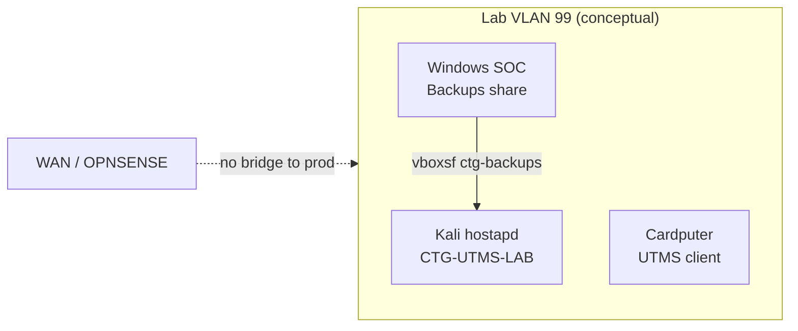
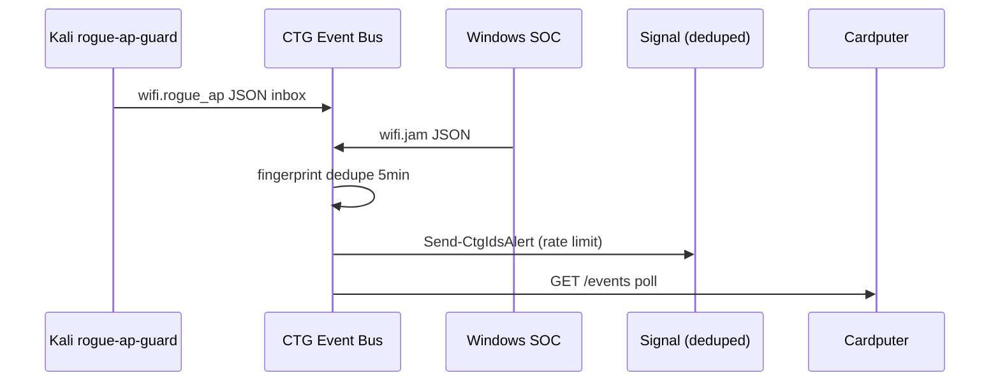
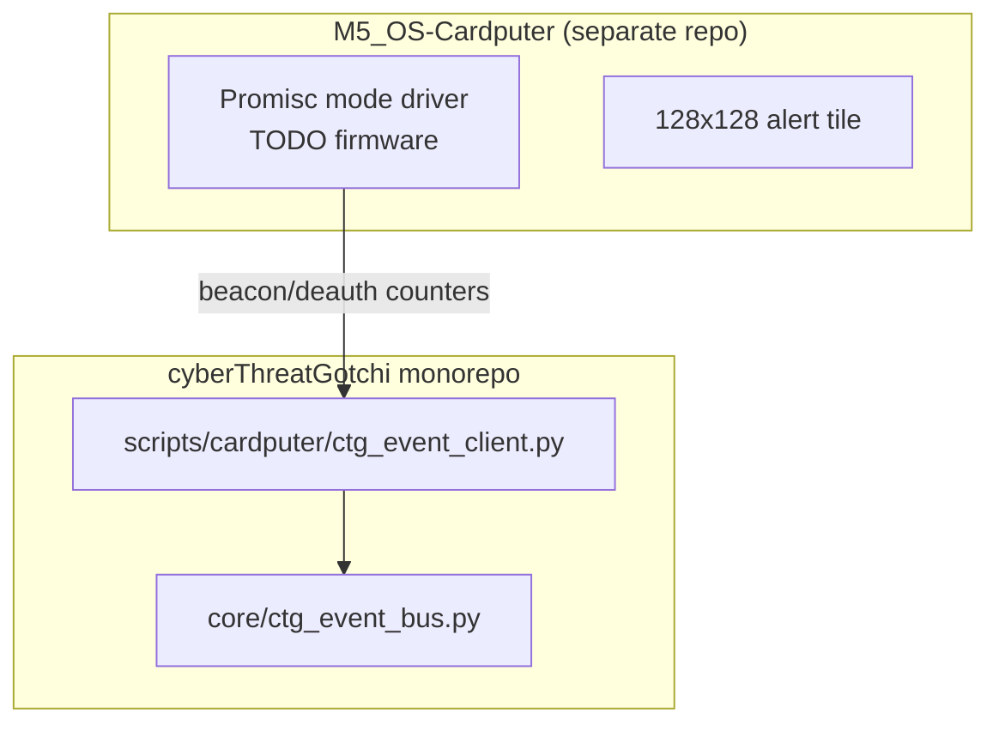
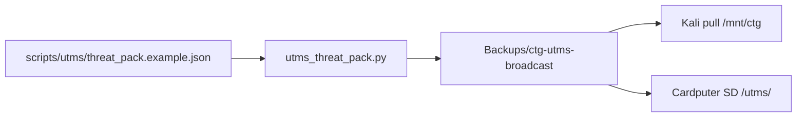

# UTMS Wi-Fi AI architectures — Hacker Planet LLC / CyberThreatGotchi

**Authorized defensive lab use only.** Andy Kowal · Philadelphia, PA · systems you **own** or are **explicitly permitted** to administer (`lab-targets.conf`, `lab-wifi.conf`). This document expands five complementary architectures for UTMS (Unified Threat Management System) Wi-Fi awareness plus **anti-jam/deauth detection and failover** — never active RF countermeasures.

**Related:** [DEFENSE_DDOS_ROGUE_WIFI.md](DEFENSE_DDOS_ROGUE_WIFI.md) · [LAB_AP_UTMS.md](LAB_AP_UTMS.md) · [CARDPUTER_UTMS_WIFI.md](CARDPUTER_UTMS_WIFI.md) · [SIGNAL_ALERTS.md](SIGNAL_ALERTS.md) · [IPHONE_HARDENING.md](IPHONE_HARDENING.md) · [GATEKEEPER_TOR.md](GATEKEEPER_TOR.md) (Tor/HTTPS tray — no RF counter-jam)

---

## Executive summary

CyberThreatGotchi ties **Windows SOC**, **Kali lab**, **M5Stack Cardputer**, and optional **iPhone** into one **CTG event bus** (`core/ctg_event_bus.py`). Wi-Fi sensors emit normalized `CTGEvent` JSON; dedupe prevents alert storms; a **rules-first analyst layer** (`core/ctg_event_summarize.py`) produces one-line SOC text without on-device LLM on ESP32. UTMS threat packs broadcast OTA from Windows Backups for lab pull. **Jam/deauth** is **detect + failover** (wired, cellular, VPN) — not jam-back (illegal under FCC Part 15 and computer-fraud statutes).

---

## Threat model (defensive)

| Threat | Observable | CTG layer | Honest limit |
|--------|------------|-----------|--------------|
| **Deauth/disassoc flood** | Wi-Fi drops; mgmt frames spike on monitor iface | Kali `ctg-deauth-watch.sh`, Windows `Detect-CtgWifiJam.ps1` | Encrypted WPA3 mgmt may hide frames; threshold is heuristic |
| **RF jamming / noise** | Link loss + gateway fail; no specific frame signature | Windows disconnect-storm + ping fail | Cannot distinguish jam from AP reboot without WIDS |
| **Evil twin / rogue AP** | Duplicate SSID, open clone, signal delta | Kali `rogue-ap-guard.sh` → `ctg-wifi-event-emit.sh` | No enterprise WIDS; nmcli scan is periodic |
| **Captive portal cred harvest** | Unexpected portal | User procedure + iPhone VPN/DNS verify | Scripts do not intercept portals |
| **UTMS IOC drift** | Stale blocklists on edge | `utms_threat_pack.py` OTA broadcast | Signature placeholder until Pro signing off-repo |

**MITRE ATT&CK (defensive mapping):** T1557 (AiTM) → BSSID verify + VPN; T1498 (Network DoS) → detect + ISP/lab failover; T1040 (Network sniffing) → authorized promisc lab only.

**NIST CSF 2.0:** **Detect (DE)** — event bus + IDS; **Respond (RS)** — Signal notify once; **Protect (PR)** — PMF/802.11w, DuckDuckGo VPN preserved ([IPHONE_HARDENING.md](IPHONE_HARDENING.md)).

---

## Architecture 1 — Field lab AP (`CTG-UTMS-LAB`)

Isolated **soft AP** on Kali for Cardputer and lab clients — **never** clone production SSIDs, **never** evil twin.



- **Docs:** [LAB_AP_UTMS.md](LAB_AP_UTMS.md)
- **Script:** `scripts/kali/ctg-lab-ap-setup.sh` — `--diagnose` default; `--apply` requires `/etc/ctg/lab-wifi.conf` + `--i-understand-lab-only`
- **Gate:** `lab-wifi.conf` (600 on Kali, gitignored) — placeholders in repo examples only
- **VLAN:** Document tie-in to homelab OPNSENSE; AP stays on isolated segment for kit demos

---

## Architecture 2 — Wi-Fi threat announcer (event bus)

LAN publishers emit **`CTGEvent`**; bus dedupes; consumers notify **once** (Signal, Kali `notify-send`, Cardputer poll, optional email Message-ID).



- **Core:** `core/ctg_event_bus.py` — emit, dedupe, persist
- **Windows:** `Start-CtgEventBus.ps1` — `127.0.0.1:8766`
- **Summarize:** `core/ctg_event_summarize.py` — rules-first analyst line
- **Email bridge:** Same dedupe store via `message_id` (RFC 5322 Message-ID)

---

## Architecture 3 — Promiscuous pocket sensor (Cardputer)

**Design:** ESP32-S3 + SX1262/M5Stack radio path in **M5_OS-Cardputer** firmware repo; monorepo ships **host stub** and docs.



**Honest limits:**

- ESP32 promisc mode: CPU/RAM bound; not a full WIDS
- No on-device LLM — display `analyst_summary` from host bus
- Battery: poll every 4s default; event-driven wake is firmware TODO

See [CARDPUTER_UTMS_WIFI.md](CARDPUTER_UTMS_WIFI.md).

---

## Architecture 4 — UTMS threat-pack broadcast (OTA)

Signed manifest + pack copy staged to `Backups\ctg-utms-broadcast` for Cardputer/Kali pull.



- **Script:** `scripts/utms_threat_pack.py` — schema `ctg-utms-broadcast-v1`, signature placeholder
- **Windows:** `Start-CtgUtmsThreatBroadcast.ps1`
- **Pro hook:** `CTG_PRO_API_KEY` off-repo for future signed feed — not in git

---

## Architecture 5 — AI analyst layer (host-side)

**Rules-first** summaries in `core/ctg_event_summarize.py`. Optional **Pro cloud template** string for upstream LLM — **no API keys in repo**, no ESP32 inference.

| Input event type | Analyst line (example) |
|------------------|------------------------|
| `wifi.deauth` | 802.11 deauth pattern — verify PMF, prefer wired failover |
| `wifi.jam` | Link instability — do not counter-jam |
| `utms.broadcast` | Threat pack staged for signed pull |

Cloud Pro: host calls template with event JSON; customer supplies keys in `.env` / vault only.

---

## Anti-jam / deauth detection & failover (defensive only)

**Legal / FCC:** Intentional jamming and unauthorized deauth **transmission** violate FCC Part 15 and CFAA. CTG implements **detection and graceful failover** only.

| Signal | Windows | Kali |
|--------|---------|------|
| Disconnect storm | `Detect-CtgWifiJam.ps1 -Watch` | — |
| Gateway loss on Wi-Fi | Same script ping fail | — |
| Deauth frame rate | — | `ctg-deauth-watch.sh -i wlan0mon` |
| Rogue SSID | — | `ctg-wifi-event-emit.sh` |

**Failover playbook:**

1. Disconnect Wi-Fi; use **Ethernet** or **cellular + DuckDuckGo VPN** (preserve DNS per [IPHONE_HARDENING.md](IPHONE_HARDENING.md))
2. Emit `CTGEvent`; optional **one** Signal via `Send-CtgIdsAlert.ps1` (15 min rate + bus dedupe)
3. Document for ISP/law enforcement if harassment pattern — see [DEFENSE_DDOS_ROGUE_WIFI.md](DEFENSE_DDOS_ROGUE_WIFI.md)

**NOT in scope:** jammer build, deauth attack tools, evil twin, credential captive portals.

### Why “overloading the jammer” is refused (explicit)

Some offensive Wi-Fi tooling proposes **transmitting** against jammers — power floods, deauth “fight-back,” or custom RF countermeasures. **CyberThreatGotchi does not implement this** and will not ship it in docs, scripts, or hidden vault blobs:

| Reason | Detail |
|--------|--------|
| **FCC Part 15** | Intentional interference with licensed or authorized radio services is illegal in the US without authorization |
| **CFAA / computer fraud** | Unauthorized deauth/disrupt frames against networks you do not own exceed defensive lab scope |
| **Project rules** | `.cursor/rules/` and Hacker Planet DevSecOps — authorized defensive lab only |
| **Effective defense** | Detection + wired/cellular failover + deduped alerts beats illegal RF escalation |

**What we ship instead:** `Detect-CtgWifiJam.ps1` (Windows disconnect storms), `ctg-deauth-watch.sh` (Kali monitor threshold), CTG event bus dedupe, one Signal notify. Sensitive lab Wi-Fi configs belong in **Ctg-CredentialVault** or gitignored `.vault/` — not concealed jammer code.

---

## CTGEvent schema v1

```json
{
  "id": "550e8400-e29b-41d4-a716-446655440000",
  "type": "wifi.deauth",
  "source": "kali",
  "severity": "high",
  "message": "Deauth/disassoc frames 62 in 60s on wlan0mon (threshold 50)",
  "bssid": "aa:bb:cc:dd:ee:ff",
  "ssid": "YourLabSSID",
  "message_id": "",
  "timestamp": "2026-05-31T18:00:00+00:00",
  "analyst_summary": "HIGH: 802.11 deauthentication/disassociation pattern detected — verify PMF, prefer wired or cellular failover. SSID=YourLabSSID."
}
```

| Field | Required | Notes |
|-------|----------|-------|
| `id` | auto | UUID v4 if omitted |
| `type` | yes | Prefix: `wifi.`, `utms.`, `ids.`, `email.`, `system.` |
| `source` | yes | `windows`, `kali`, `cardputer`, `email-bridge` |
| `severity` | yes | `info`, `warn`, `high`, `critical` |
| `message` | yes | Human text; no PII |
| `bssid`, `ssid` | optional | Wi-Fi context |
| `message_id` | optional | Email dedupe (RFC Message-ID) |
| `timestamp` | auto | ISO8601 UTC |
| `analyst_summary` | auto | Rules engine on emit |

---

## Dedupe algorithm

1. **Email:** If `message_id` present, suppress duplicate within **5 minutes** (same store as Wi-Fi).
2. **Wi-Fi:** `SHA256(type + "|" + ssid + "|" + bssid)` — suppress within **5 minutes**.
3. **Signal/SMS:** Existing `sms-rate-limit.json` per `AlertType` (15 min) — layered after bus accept.
4. **State file (gitignored):** `%USERPROFILE%\Backups\.vault\ctg-event-state.json`

```python
# core/ctg_event_bus.py — fingerprint
raw = f"{event.type}|{event.ssid}|{event.bssid}".encode("utf-8")
fingerprint = hashlib.sha256(raw).hexdigest()
```

---

## Integration map

| Platform | Role | Entry point |
|----------|------|-------------|
| **Windows SOC** | Bus server, jam detect, UTMS broadcast | `Start-CtgEventBus.ps1`, `Detect-CtgWifiJam.ps1` |
| **Kali lab** | Rogue AP scan, deauth watch, desktop notify | `ctg-wifi-event-emit.sh`, `ctg-deauth-watch.sh`, `ctg-event-notify.sh` |
| **Cardputer** | Pocket display + future promisc | `scripts/cardputer/ctg_event_client.py` + M5 firmware |
| **iPhone** | User VPN/DNS preservation | [IPHONE_HARDENING.md](IPHONE_HARDENING.md) — scripts do not replace DDG |
| **Signal** | Deduped mobile alert | `Send-CtgIdsAlert.ps1` |
| **Email** | Optional bridge | `message_id` dedupe on bus |

**Share path:** `C:\Users\Owner\Backups` → VirtualBox `ctg-backups` → `/mnt/ctg` — events in `ctg-events/inbox/`.

---

## Product / kits narrative (Year 1 ~$84K)

Hacker Planet **CyberThreatGotchi kits** ship with:

- Windows SOC scripts + encrypted vault pattern
- Kali lab share + CLICK-ME autorun
- Cardputer UTMS display firmware path (M5_OS-Cardputer)
- Example UTMS pack + OTA manifest for lab exercises
- Pro tier: signed threat feed + optional cloud analyst template

Positioning: **CISO portfolio** — detect rogue Wi-Fi and link attacks, broadcast UTMS intel to field devices, notify once — not offensive Wi-Fi tooling.

---

## Verification

```powershell
cd C:\Users\Owner\Programs\Hacker Planet LLC\cyberThreatGotchi
```

```powershell
.\scripts\windows\Start-CtgEventBus.ps1 -DiagnoseOnly
```

```powershell
pytest tests/test_ctg_event_bus.py tests/test_ctg_event_summarize.py -q
```

```bash
sudo bash /mnt/ctg/ctg-deauth-watch.sh --diagnose
```

---

## Authorized use (mandatory)

- Hacker Planet LLC lab, Andy-owned hosts, MSP scope in writing
- **Refuse:** coffee-shop scanning, jam-back, deauth tools against third parties

**Preserve DuckDuckGo VPN/DNS** — all CTG hardening docs cross-link [IPHONE_HARDENING.md](IPHONE_HARDENING.md) and `Preserve-DuckDuckGoVpn.ps1`.
